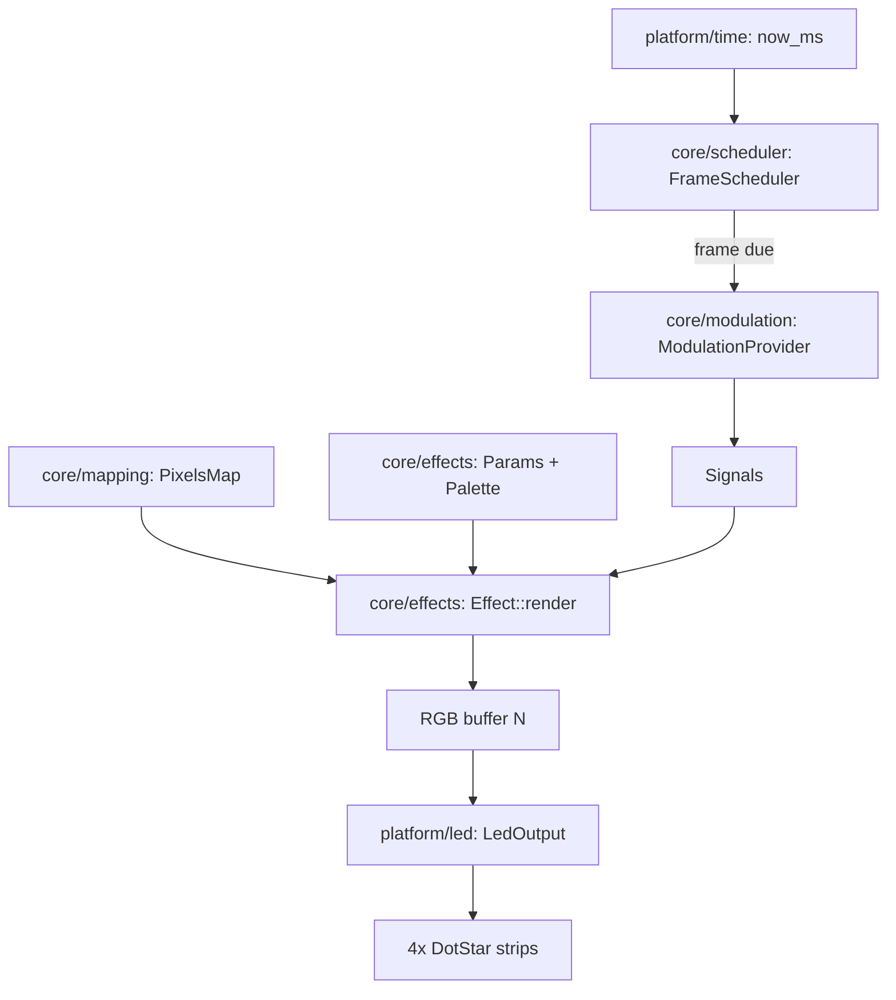

# WLED Integration — Implementation Plan (Chromance Control)

This document turns `docs/architecture/wled_integration_preplan.md` into a concrete, repo-grounded implementation plan. It is a plan only: no firmware features are implemented here.

## 1) Scope & non-goals

**In scope (this plan covers):**
- Decide between WLED integration strategies (Options A/B/C from the pre-plan) via a measurable spike.
- Build a portable effects engine (`core/`) with:
  - effect registry + selection
  - parameter model
  - frame scheduler with runtime `target_fps` (0 = uncapped), owned by scheduler/render config (not effects)
  - deterministic “time in, pixels out” effect signature
  - `Signals`/`ModulationInputs` struct and `ModulationProvider` interface (stubs for future)
- Chromance mapping pipeline with deterministic `ledmap.json` generation and validation:
  - `mapping/wiring.json` (authoritative strip/segment order + direction)
  - `mapping/pixels.json` (optional richer map for our engine and simulator)
  - `mapping/ledmap.json` (WLED artifact)
  - generator: `scripts/generate_ledmap.py`
- Output layer abstraction for 4 DotStar strips, plus basic perf instrumentation (`flush_ms`, `frame_ms`).
- (Optional, planned) web simulator: compile only portable core to WASM; render using `pixels.json`.

**Explicit non-goals (deferred):**
- Networking responsiveness under load; packet-loss testing; “liveview/peek” streaming details.
- Sound-reactive features (mic/FFT/envelope).
- Heartbeat/biofeedback ingestion.

Architecture requirement despite deferrals:
- Effects must accept `Signals` (defaults represent “not provided”).
- A `ModulationProvider` interface must exist (stubbed), so adding audio/BPM later does not change effect signatures.
- `core/` remains portable and Arduino-free; `platform/` owns hardware, time, storage, and networking (when/if used).

## 2) Milestones and sequencing (4–7 milestones)

### Milestone 0 — Establish `mapping/wiring.json` source of truth (prerequisite)

This milestone is a prerequisite for mapping generation, bench mode, and any WLED `ledmap.json` usage.

**Deliverables**
- Confirm and lock the canonical `mapping/wiring.json` schema:
  - 4 strips
  - per-strip ordered list of segment IDs
  - per-segment direction (`a_to_b` / `b_to_a`) for LED index assignment
- Create initial canonical wiring artifacts:
  - `mapping/wiring.json` (full 4-strip wiring if already known)
  - `mapping/wiring_bench.json` (at minimum: strip 0 only / bench subset to unblock development)
- Align generator workflow:
  - If `mapping/wiring_bench.json` is a strict subset of segments, plan to extend `scripts/generate_ledmap.py` to support subset generation (bench mode) without changing full-sculpture defaults.

**Acceptance criteria**
- `mapping/wiring.json`:
  - references all segment IDs `{1..40}` exactly once (no missing, no duplicates)
  - strip segment counts match the hardware distribution where applicable (11/12/6/11 per `src/core/layout.h`) OR intentional deviations are documented
- `mapping/wiring_bench.json`:
  - is explicitly a subset (documents which segments are present) and does not pretend to be the full sculpture wiring
- Generator can run successfully using the canonical wiring file(s):
  - full: `python3 scripts/generate_ledmap.py --wiring mapping/wiring.json ...`
  - bench (if subset): supported when `mapping/wiring_bench.json` sets `isBenchSubset: true`

**Risks / mitigations**
- Risk: wiring order/direction is not yet fully confirmed.
  - Mitigation: start with a bench subset that is physically verified; treat full wiring as a gated artifact that must pass Index_Walk and mapping tests before being declared canonical.

**Complexity**: Medium

### Milestone 1 — WLED feasibility spike + decision gate (Option B viability)

**Deliverables**
- A minimal WLED build attempt for the target board (ESP32 Feather) with 4 APA102/DotStar outputs enabled (as feasible).
- Measurements aligned to the pre-plan’s “Measurable spike success criteria” (heap headroom, FPS, flicker/corruption).
- Explicit conclusion: Option A vs B vs C, with rationale and recorded measurements.

**Primary kill gate for Option B: WLED multi-bus LED index model**

Experiment spec (concrete):
1) Configure 4 output busses with known lengths (matching Chromance strip lengths derived from `src/core/layout.h`):
   - `11 segments * 14 LEDs = 154`
   - `12 * 14 = 168`
   - `6 * 14 = 84`
   - `11 * 14 = 154`
2) Set distinct colors at each bus’s first pixel:
   - bus0 LED0 = Red, bus1 LED0 = Green, bus2 LED0 = Blue, bus3 LED0 = Magenta.
3) Determine how WLED addresses pixels:
   - Is there a single contiguous LED index space (0..total-1)?
   - Or per-bus index spaces (each bus starts at 0)?
4) Load a test `ledmap.json` that references indices around bus boundaries and verify how WLED interprets indices relative to the multi-bus configuration.

Outcomes:
- If WLED provides a contiguous index space aligned to `ledmap.json` indices 0..(total-1) → Option B remains viable.
- If WLED uses per-bus indexing or overlapping index spaces → Option B is not viable without a remapping layer or deeper fork; choose Option C (or treat Option B as “requires fork/remap” explicitly).

How `ledmap.json` indices interpret under each model (brief):
- Contiguous model: `ledmap.json` indices refer to the single global strip index space WLED renders into.
- Per-bus model: a single integer index is ambiguous across busses; `ledmap.json` cannot unambiguously select pixels without a remap layer (or flattening all pixels into one “virtual bus”).

**Acceptance criteria**
- FIRST: run the multi-bus index model experiment above and record a PASS/FAIL outcome:
  - PASS (contiguous indices 0..N-1 across 4 busses with compatible `ledmap.json` interpretation) → Option B remains viable.
  - FAIL (per-bus/overlapping indices) → Option B not viable without remap/fork; next step is Option C (or explicitly “Option B requires remap layer”).
- ≥ 80KB free heap at idle with WiFi/UI/control plane enabled (measure repeatedly).
- Stable animation at ≥ 30 FPS for 5 minutes.
- No random flicker/data corruption across all 4 strips for 10 minutes at chosen bus clock.

**Risks / mitigations**
- Risk: WLED multi-bus APA102 support is limited or unstable.
  - Mitigation: fall back to Option C (keep our firmware) and keep WLED interop as a protocol/control surface only.

**Complexity**: High

### Milestone 2 — Mapping artifacts + generator hardening

**Deliverables**
- Create `mapping/` directory with:
  - `mapping/wiring.json` (authoritative order+direction; established in Milestone 0)
  - generated `mapping/ledmap.json` and `mapping/pixels.json` from `scripts/generate_ledmap.py`
- Documented mapping invariants implemented as host tests (`pio test -e native`) that validate generated artifacts.
- Bench-mode mapping subset strategy (see section 7).

**Acceptance criteria**
- Mapping invariants all pass:
  - full sculpture: `N=560` unique indices (0..559), collision-free, bounds minimal, segment coverage `{1..40}` exactly once
  - bench subset (if used): `N=14*segments_in_wiring_bench` (0..N-1), collision-free, bounds minimal, segment IDs match declared subset
- C++ firmware headers are generated and treated as required artifacts:
  - `include/generated/chromance_mapping_full.h`
  - `include/generated/chromance_mapping_bench.h`
- Firmware mapping uses generated headers (zero-copy) and performs **no runtime JSON parsing** for mapping tables.
- Bench selection is verified:
  - When built with `CHROMANCE_BENCH_MODE=1`, firmware includes `include/generated/chromance_mapping_bench.h` (not the full header).
- Visual validation patterns run (either in simulator or in firmware/WLED) and meet acceptance criteria from the pre-plan.

**Risks / mitigations**
- Risk: rasterization collisions from rounding.
  - Mitigation: generator enhancements (planned only): `--x-scale/--y-scale/--t-offset/--flip-*` and collision reporting; adjust projection deterministically.

**Complexity**: Medium

### Milestone 3 — Portable effects core + scheduler + baseline validation patterns

**Deliverables**
- New `core/` modules for:
  - effect interface + registry
  - parameter model (baseline: brightness/speed/intensity/palette)
  - frame scheduler implementing runtime `target_fps` (0 = uncapped)
  - `Signals` struct and `ModulationProvider` interface (stub implementation)
- Implement two “mapping validation patterns” in the effects engine:
  - `XY_Scan_Test`
  - `Coord_Color_Test`
- Deterministic unit tests for scheduler and registry; optional snapshot tests for patterns.

**Acceptance criteria**
- `pio test -e native` passes with new tests.
- Effects run deterministically for fixed time/inputs.

**Risks / mitigations**
- Risk: parameter model grows ad-hoc.
  - Mitigation: define a stable, versioned `EffectParams` schema early and keep effect-specific params isolated.

**Complexity**: Medium

### Milestone 4 — Output layer refactor + perf instrumentation + bench mode

**Deliverables**
- Stable `platform/led/` interface that can:
  - consume a unified RGB buffer (`N = active_led_count`) or per-strip buffers
  - map global LED indices to (strip, stripLedIndex) per `wiring.json` ordering
- Perf instrumentation hooks:
  - `flush_ms` (LED driver update time)
  - `frame_ms` (end-to-end frame time)
- Bench mode for partial hardware testing (compile-time define + wiring subset).

**Acceptance criteria**
- On device: validation patterns run without flicker/corruption; `flush_ms`/`frame_ms` logging works.
- Bench mode works with a single strip or partial LED count, without requiring the full sculpture.

**Risks / mitigations**
- Risk: current DotStar driver path is software SPI and too CPU-expensive.
  - Mitigation: keep interface stable; allow swapping to hardware SPI variant or alternative driver later.

**Complexity**: Medium

### Milestone 5 — Option execution (A/B/C chosen) + minimal integration

**Deliverables**
- If Option C: integrate the portable core engine into the firmware main loop with minimal control plane (local-only; no deep network work).
- If Option B: adopt WLED baseline and integrate Chromance ledmap + custom effect entrypoint; document which repo modules are obsolete (see section 8).
- If Option A: interop boundary defined; minimal bridging layer added without forking WLED deeply.

**Acceptance criteria**
- Selected option runs the validation patterns and demonstrates stable 2D mapping.
- No architectural backsliding: `core/` remains portable and testable.

**Complexity**: High

### Milestone 6 (Optional) — Web simulator viewer (WASM shared-core)

**Deliverables**
- `tools/sim/` web viewer that loads `mapping/pixels.json` and renders frames from WASM-compiled core effects.
- Runs `XY_Scan_Test` and `Coord_Color_Test` with `target_fps`.

**Acceptance criteria**
- Simulator output matches on-device mapping orientation and holes handling.

**Complexity**: Medium

## 3) Current repo map (as-is)

**Build + environments**
- `platformio.ini`:
  - `env:diagnostic` (ESP32)
  - `env:native` (Unity host tests)
- `scripts/wifi_from_env.py` injects `WIFI_SSID/WIFI_PASSWORD/OTA_HOSTNAME` build-time defines.

**Firmware entry + loop**
- `src/main_diagnostic.cpp`: cooperative loop calling `ota.handle()`, ticking pattern with `millis()`, frame-capped rendering, and OTA “updating” rate reduction.

**Platform layer**
- `src/platform/ota.h`, `src/platform/ota.cpp`: WiFi STA + ArduinoOTA lifecycle.
- `src/platform/wifi_config.h`: build-flag and `include/wifi_secrets.h` fallback.
- `src/platform/dotstar_leds.h`, `src/platform/dotstar_leds.cpp`: 4× `Adafruit_DotStar` instances and segment rendering.

**Core logic (Arduino-free)**
- `src/core/layout.h`: strip count, segment counts (11/12/6/11), pins, colors, `static_assert`s.
- `src/core/strip_layout.h`: segment-to-linear-LED mapping helpers.
- `src/core/diagnostic_strip_sm.h`, `src/core/diagnostic_pattern.h`: diagnostic state machine and orchestrator.
- `src/core/types.h`: `Rgb` type.

**Mapping generator**
- `scripts/generate_ledmap.py`: generates `mapping/ledmap.json` and optional `mapping/pixels.json` from `mapping/wiring.json` (required) and the embedded 40-edge segment list.

**Tests**
- `test/test_main.cpp`: Unity runner.
- `test/test_layout.cpp`, `test/test_segments.cpp`, `test/test_diagnostic_pattern.cpp`: existing core tests.

## 4) Target architecture (to-be)

Directory layout (new/expanded):
- `src/core/effects/` (portable)
- `src/core/mapping/` (portable)
- `src/core/scheduler/` (portable)
- `src/core/modulation/` (portable interfaces only for now)
- `src/platform/led/` (DotStar driver + mapping-to-strips)
- `src/platform/time/` (time source abstraction)
- `src/platform/storage/` (optional; for loading mapping/presets later)

Mermaid frame flow (Option C / our engine path):


## 5) File-by-file implementation plan (MOST IMPORTANT)

This section lists planned repo changes. Where a file exists today, it is listed under “modify”; otherwise “add”.

Build environment rules (repo-grounded):
- `src/core/**` is portable and must compile in both:
  - `env:native` (host tests; see `platformio.ini`)
  - `env:diagnostic` (firmware; see `platformio.ini`)
  - No Arduino headers/types in `src/core/**`.
- `src/platform/**` is firmware-only and compiles only in `env:diagnostic` (and any future firmware envs we add).

### 5.0 `mapping/` artifacts (add)

**Purpose**
- Make the mapping pipeline executable and reviewable (inputs committed; outputs reproducible).

**Build environments**
- N/A (data files).

**Dependencies / prerequisites**
- Milestone 0 complete: canonical `mapping/wiring.json` exists (and `mapping/wiring_bench.json` if using bench subset).

**Files**
- `mapping/wiring.json` (required input to `scripts/generate_ledmap.py`)
- `mapping/ledmap.json` (generated; WLED custom 2D map)
- `mapping/pixels.json` (generated; engine + simulator input)

**Key logic**
- `mapping/wiring.json` is the source of truth for strip order, segment order, and direction (A→B vs B→A).

**Tests to add**
- `test/test_wiring_invariants.cpp` and `test/test_ledmap_invariants.cpp` (see section 7).

### 5.0b `scripts/generate_ledmap.py` (modify)

**Purpose**
- Keep the generator as the single executable reference implementation of the mapping algorithm and invariants.

**Build environments**
- Host tool (runs outside PlatformIO; used by developers/CI).

**Dependencies / prerequisites**
- Requires `mapping/wiring.json` input.
- Segment list must remain aligned with `docs/architecture/wled_integration_preplan.md` and the embedded `SEGMENTS` list.

**Current behavior (repo-grounded)**
- Reads `mapping/wiring.json` (required).
- Uses embedded `SEGMENTS` list (40 edges) and the fixed projection/sampling rules.
- Writes `mapping/ledmap.json` and optional `mapping/pixels.json`.
- Fails hard on segment coverage issues and pixel collisions.

**Required behavior (firmware mapping source of truth)**
- The generator MUST emit C++ headers into `include/generated/` as the default firmware mapping source.
- Header outputs (stable names):
  - `include/generated/chromance_mapping_full.h` (full 4-strip sculpture)
  - `include/generated/chromance_mapping_bench.h` (bench-mode subset)
- Headers contain `static const` (flash-stored) tables for at minimum:
  - `LED_COUNT` (active LED count for that build: 560 full, bench derived)
  - `pixel_x[]`, `pixel_y[]` (or packed `pixel_xy[]`) for `PixelsMap`
  - `global_to_strip[]`, `global_to_local[]` for `LedOutput` (global index → stripId/stripOffset)
- Firmware consumes these tables zero-copy; no JSON parsing at runtime.
- Native tests/simulator may either reuse the same generated headers (preferred) or load JSON (optional).

**Optional enhancements (doc-only)**
- Add tuning flags (`--x-scale`, `--y-scale`, `--flip-x`, `--flip-y`, `--t-offset`) without changing defaults.
- Add richer `pixels.json` metadata: `strip`, `seg`, `k`, `dir`, `strip_led_index`.
- Add `--validate-only` for validating existing artifacts.
- Add optional preview output (scatter PNG) for fast silhouette checks.
- Add lightweight mapping version propagation:
  - accept top-level `mappingVersion` in `mapping/wiring.json`
  - propagate `mappingVersion` into generated `mapping/pixels.json` and `mapping/ledmap.json` for compatibility checks
- Add an explicit subset mode for bench development:
  - accept `mapping/wiring_bench.json` containing a strict subset of segment IDs
  - emit a smaller `ledmap.json`/`pixels.json` with indices `0..(N-1)` where `N = segments*14`
  - keep full-sculpture mode strict: `{1..40}` exactly once

### 5.1 `src/core/modulation/signals.h` (add)

**Purpose**
- Define the stable effect input struct for future sound/BPM/breath-phase without changing effect signatures later.

**Build environments**
- `env:native`, `env:diagnostic`.

**Dependencies / prerequisites**
- None.

**API (pseudo)**
```cpp
namespace chromance::core {
struct Signals {
  static constexpr float kNotProvided = -1.0f;
  float audio_level = kNotProvided;   // 0..1 when present
  float audio_beat = kNotProvided;    // 0..1 when present
  float bpm = kNotProvided;           // >0 when present
  float breath_phase = kNotProvided;  // 0..1 when present

  bool has_audio_level() const { return audio_level >= 0.0f; }
  bool has_audio_beat() const { return audio_beat >= 0.0f; }
  bool has_bpm() const { return bpm >= 0.0f; }
  bool has_breath_phase() const { return breath_phase >= 0.0f; }
};
}
```

**Key logic**
- Defaults represent “not provided” (sentinel values) so effects can distinguish “missing” vs “zero”.

**Tests**
- None needed.

### 5.2 `src/core/modulation/provider.h` (add)

**Purpose**
- Provide a seam for future sensor ingestion without touching effects.

**Build environments**
- `env:native`, `env:diagnostic`.

**Dependencies / prerequisites**
- `src/core/modulation/signals.h`.

**API (pseudo)**
```cpp
namespace chromance::core {
class IModulationProvider {
 public:
  virtual ~IModulationProvider() = default;
  virtual Signals sample(uint32_t now_ms) = 0;
};

class NullModulationProvider final : public IModulationProvider {
 public:
  Signals sample(uint32_t) override { return Signals{}; } // returns “not provided” defaults
};
}
```

**Tests**
- None needed.

Note:
- `NullModulationProvider` relies on the `Signals::kNotProvided` sentinel values to indicate “not present”.

### 5.3 `src/core/scheduler/frame_scheduler.h` (add)

**Purpose**
- Runtime FPS cap (`target_fps`; 0=uncapped) with deterministic frame gating.
  - Effects must not depend on FPS caps; they render based on time input (`FrameTime`), not on the scheduler.

**Build environments**
- `env:native`, `env:diagnostic`.

**Dependencies / prerequisites**
- None.

**API (pseudo)**
```cpp
namespace chromance::core {
struct RenderConfig {
  uint16_t target_fps = 60; // 0 = uncapped
};

class FrameScheduler {
 public:
  void set_target_fps(uint16_t fps); // 0 = uncapped
  bool should_render(uint32_t now_ms);
 private:
  uint16_t target_fps_ = 60;
  uint32_t next_frame_ms_ = 0;
};
}
```

**Algorithm (step-by-step)**
- First-call initialization: if `next_frame_ms_ == 0`, set `next_frame_ms_ = now_ms` and return true (render immediately).
- If `target_fps_ == 0`: return true.
- Else:
  - `period_ms = max(1, 1000/target_fps_)`
  - if `now_ms < next_frame_ms_`: return false
  - else:
    - Drift/catch-up policy (accumulating time; preserves average tempo):
      - `next_frame_ms_ += period_ms` (not `next_frame_ms_ = now_ms + period_ms`)
    - Reset to avoid death spirals if we miss too many frames:
      - exact condition: `if ((now_ms - next_frame_ms_) > 5 * period_ms) next_frame_ms_ = now_ms;`
    - return true
- Use signed wrap-safe time comparisons (`int32_t(now_ms - next_frame_ms_)`).

**Tests to add**
- `test/test_frame_scheduler.cpp`:
  - fps=0 always renders
  - fps=50 renders roughly every 20ms and rejects intermediate calls
  - wrap-around behavior via synthetic times

### 5.4 `src/core/effects/effect.h` (add)

**Purpose**
- Standard effect signature: time + mapping + params + signals → RGB buffer.

**Build environments**
- `env:native`, `env:diagnostic`.

**Dependencies / prerequisites**
- `src/core/modulation/signals.h`
- `src/core/mapping/pixels_map.h`
- `src/core/effects/params.h`

**API (pseudo)**
```cpp
namespace chromance::core {
struct FrameTime { uint32_t now_ms; float dt_s; };
struct Rgb8 { uint8_t r,g,b; };
class PixelsMap; // forward
struct EffectParams; // forward

class IEffect {
 public:
  virtual ~IEffect() = default;
  virtual const char* id() const = 0;
  virtual void render(const FrameTime& t,
                      const PixelsMap& map,
                      const Signals& sig,
                      const EffectParams& params,
                      Rgb8* out_rgb,
                      size_t out_len) = 0; // out_len must equal map.led_count()
};
}
```

**Key logic**
- Keep effect pure-ish (no sleeping, no IO).
- Enforce `out_len == map.led_count()` at call sites (full sculpture is 560; bench is smaller).

**Tests**
- Registry tests (below).

### 5.5 `src/core/effects/params.h` (add)

**Purpose**
- Provide a stable baseline parameter model without reinventing WLED.

**Build environments**
- `env:native`, `env:diagnostic`.

**Dependencies / prerequisites**
- None.

**API (pseudo)**
```cpp
namespace chromance::core {
struct EffectParams {
  uint8_t brightness = 128;
  uint8_t speed = 128;
  uint8_t intensity = 128;
  uint16_t palette_id = 0;
  // Future: effect-specific blob via tagged union or byte span.
};
}
```

**Tests**
- None initially; evolve with preset schema.

### 5.6 `src/core/effects/registry.h` (add)

**Purpose**
- Register effects by id and select active effect.

**Build environments**
- `env:native`, `env:diagnostic`.

**Dependencies / prerequisites**
- `src/core/effects/effect.h`

**API (pseudo)**
```cpp
namespace chromance::core {
class EffectRegistry {
 public:
  bool register_effect(IEffect* effect);
  IEffect* find(const char* id) const;
 private:
  IEffect* effects_[kMaxEffects];
  uint8_t count_;
};
}
```

**Algorithm**
- `register_effect` rejects null, duplicate ids, or overflow.
- `find` linearly searches; no dynamic allocations.

**Tests to add**
- `test/test_effect_registry.cpp`:
  - duplicate id rejected
  - find returns correct pointer

### 5.7 `src/core/mapping/pixels_map.h` (add)

**Purpose**
- Runtime structure for `ledIndex -> (x,y)` and derived fields used by effects.

**Build environments**
- `env:native`, `env:diagnostic`.

**Dependencies / prerequisites**
- Requires a mapping source:
  - firmware default: generated headers in `include/generated/` (`chromance_mapping_full.h` or `chromance_mapping_bench.h`)
  - host/simulator optional: `mapping/pixels.json` for convenience

**API (pseudo)**
```cpp
namespace chromance::core {
struct PixelCoord { int16_t x; int16_t y; };

class PixelsMap {
 public:
  size_t led_count() const;
  PixelCoord coord(uint16_t led_index) const;
  PixelCoord center() const;
  float radius_norm(uint16_t led_index) const; // future convenience; not required for validation patterns

  // Stable scan order for XY_Scan_Test (sorted by y, then x, then ledIndex).
  // Implementation may precompute once at init to avoid per-frame work.
  void build_scan_order(uint16_t* out_led_indices, size_t out_len) const;
};
}
```

**Key logic**
- Firmware uses generated headers (default; zero-copy):
  - `include/generated/chromance_mapping_full.h` or `include/generated/chromance_mapping_bench.h`
  - `PixelsMap` becomes a thin view over `pixel_x[]/pixel_y[]` (or `pixel_xy[]`) and `LED_COUNT`.
- Host tests and simulator:
  - Preferred: include the same generated headers for consistency.
  - Optional: load `mapping/pixels.json` (secondary path; developer convenience).

Bench vs full header selection mechanism (single rule; applies to PixelsMap + LedOutput + main):
- Use preprocessor selection:
  - `#if CHROMANCE_BENCH_MODE` include `include/generated/chromance_mapping_bench.h`
  - `#else` include `include/generated/chromance_mapping_full.h`
- The `CHROMANCE_BENCH_MODE` define is provided via PlatformIO build flags (per-environment).

Mapping Tables Contract (shared-array alignment; required)
- All generated mapping tables share the same `LED_COUNT`.
- For each `i` in `[0..LED_COUNT-1]`:
  - `pixel_x[i]`, `pixel_y[i]` correspond to the same LED index as the RGB buffer element `rgb[i]`.
  - `global_to_strip[i]`, `global_to_local[i]` map that same `i` to a physical output pixel (strip id + strip-local offset).
This contract prevents mismatches between coordinate tables and strip-local tables.

**Tests**
- If `mapping/pixels.json` is committed, add a test that validates bounds, uniqueness, and basic center/radius computations.

### 5.8 `src/core/effects/pattern_xy_scan.h` and `pattern_coord_color.h` (add)

**Purpose**
- Implement `XY_Scan_Test` and `Coord_Color_Test` as effects, so they can be run in:
  - our firmware
  - simulator
  - (optionally) WLED custom effect path later

**Build environments**
- `env:native`, `env:diagnostic`.

**Dependencies / prerequisites**
- `src/core/effects/effect.h`
- `src/core/mapping/pixels_map.h`
- For `XY_Scan_Test`: a stable scan order derived from `pixels.json` coords (sort by `(y, x, ledIndex)` once at init; see `PixelsMap::build_scan_order`).

**XY_Scan pseudo-logic (canonical for custom engine: sorted-pixels scan)**
- Precompute a stable scan order of LED indices by sorting `(y, x, ledIndex)` using `pixels.json` coords:
  - `scan_order = stable_sort(indices=0..N-1, key=(coord.y, coord.x, ledIndex))`
- Iterate `scan_order` with a time-based cursor:
  - `step = floor((now_ms - start_ms) / hold_ms) % N`
  - light only `scan_order[step]`, output black elsewhere.
- Reserve “grid scan” as a WLED/`ledmap.json`-specific behavior; do not require grid scan for our custom engine.

**Coord_Color pseudo-logic**
- For each LED index:
  - `r = map_x_normalized( coord.x )`
  - `g = map_y_normalized( coord.y )`
  - optional `b = radius_norm`

**Tests**
- Optional snapshot tests on host: hash a small set of sample LEDs for deterministic inputs.

### 5.9 `src/platform/led/led_output.h` (add) and `src/platform/led/dotstar_output.*` (refactor from existing)

**Purpose**
- Provide a stable output interface independent of effect engine choices.
- Hide the mapping from global LED index (0..(N-1)) to physical (strip, stripLedIndex).

**Build environments**
- `env:diagnostic` only.

**Dependencies / prerequisites**
- Requires a global-index mapping that matches `mapping/wiring.json` ordering (full) or `mapping/wiring_bench.json` (bench).
- Requires a stable `core::Rgb8` representation (or an adapter).

**API (pseudo)**
```cpp
namespace chromance::platform {
struct PerfStats { uint32_t flush_ms; uint32_t frame_ms; };

class ILedOutput {
 public:
  virtual ~ILedOutput() = default;
  virtual void begin() = 0;
  virtual void show(const chromance::core::Rgb8* rgb, size_t len, PerfStats* stats) = 0;
};
}
```

**Key logic steps**
- Map global index → strip index + strip-local index using wiring order (generated from `mapping/wiring.json` or derived header).
- For each strip:
  - setPixelColor for its local pixels
  - call `show()`
  - measure per-strip and total `flush_ms` (coarse timing ok)

Mapping Tables Contract reminder (drift prevention):
- For each `i` in `[0..LED_COUNT-1]`, `rgb[i]`, `pixel_x/y[i]`, and `global_to_strip/local[i]` must refer to the same LED index.

**Tests**
- Host-side: mapping from global index to strip-local indices can be tested purely in `core/` if implemented there.

### 5.10 `src/platform/time/time_source.h` (add)

**Purpose**
- Abstract time source (Arduino `millis()` vs host).

**Build environments**
- `env:diagnostic` only (platform abstraction); host can use direct time injection in tests.

**Dependencies / prerequisites**
- None.

**API (pseudo)**
```cpp
namespace chromance::platform {
class ITimeSource { public: virtual uint32_t now_ms() = 0; };
}
```

### 5.11 `src/main_runtime.cpp` (add) and `platformio.ini` (modify)

**Purpose**
- New main that runs the portable effects engine + scheduler + mapping validation patterns (Option C path).

**Build environments**
- Firmware-only:
  - Today: only `env:diagnostic` exists.
  - Planned: add a new firmware env (example `env:runtime`) so `env:diagnostic` can remain the diagnostic firmware unchanged.

**Dependencies / prerequisites**
- Milestone 0: at least a bench wiring file exists so the engine can run on partial hardware.
- Core engine modules (effects/registry/scheduler/mapping/modulation) exist.
- Platform LED output exists.

**PlatformIO changes (concrete)**
- Add a new firmware environment (example: `env:runtime`) alongside `env:diagnostic`, so we can keep diagnostic firmware intact:
  - `build_src_filter` includes `src/main_runtime.cpp`, `src/core/**`, `src/platform/**` (and excludes other mains).
- Keep `env:native` restricted to Arduino-free `src/core/**` as it is today.

Bench/full selection (consistent with `PixelsMap`):
- Add build flags for the runtime env(s):
  - Full sculpture build: `-D CHROMANCE_BENCH_MODE=0`
  - Bench build: `-D CHROMANCE_BENCH_MODE=1`

Single source of truth note (avoid local drift):
- Until we introduce distinct `env:runtime_full` / `env:runtime_bench`, developers flip bench vs full by changing only the `CHROMANCE_BENCH_MODE` build flag in the chosen runtime firmware environment.

**Loop pseudo-logic**
Setup-time:
1) `scheduler.set_target_fps(render_config.target_fps)` (FPS ownership lives in render config + scheduler).

Loop:
1) `ota.handle()` (if OTA is retained).
2) `now = time.now_ms()`
3) `signals = modulation.sample(now)` (Null provider for now)
4) `if (!scheduler.should_render(now)) return;`
5) `led_count = map.led_count()`
6) `effect->render(time, map, signals, params, rgb_buf, led_count)`
7) `frame_start = now` (or `time.now_ms()`)
8) `led_out.show(rgb_buf, led_count, &stats)` (stats includes `flush_ms`)
9) `stats.frame_ms = time.now_ms() - frame_start`
10) log `flush_ms` and `frame_ms` at a low rate

**Tests**
- None directly; covered by core tests.

### 5.12 `src/platform/led/dotstar_leds.*` (modify or move; decision)

**Purpose**
- Reuse existing DotStar wiring/instantiation logic in `src/platform/dotstar_leds.*`, but adapt it to the new `platform/led/ILedOutput` interface.

**Build environments**
- `env:diagnostic` only.

**Dependencies / prerequisites**
- `src/platform/led/led_output.h` interface exists (or adapter plan chosen).

**Plan**
- Either:
  - Move to `src/platform/led/dotstar_output.*` and keep a thin compatibility shim, or
  - Keep location and add an adapter class that implements `ILedOutput`.

**Key logic**
- Confirm whether the current `Adafruit_DotStar` construction path is software SPI vs hardware SPI on the library version in use, and keep this explicitly measurable via `flush_ms`.

## 6) Mapping pipeline: exact algorithms & schemas

This section is derived from the pre-plan’s “Chromance 2D Mapping (WLED ledmap.json)” and aligned to `scripts/generate_ledmap.py`.

### 6.1 Segment list (40 undirected edges, in vertex coords)

Use the segment list exactly as defined in `docs/architecture/wled_integration_preplan.md` and embedded in `scripts/generate_ledmap.py` as `SEGMENTS`:

1. (0,1)-(0,3)
2. (0,1)-(1,0)
3. (0,1)-(1,2)
4. (0,3)-(1,4)
5. (1,0)-(2,1)
6. (1,2)-(1,4)
7. (1,2)-(2,1)
8. (1,4)-(1,6)
9. (1,4)-(2,3)
10. (1,4)-(2,5)
11. (1,6)-(2,7)
12. (2,1)-(2,3)
13. (2,1)-(3,0)
14. (2,1)-(3,2)
15. (2,3)-(3,4)
16. (2,5)-(2,7)
17. (2,5)-(3,4)
18. (2,7)-(3,6)
19. (2,7)-(3,8)
20. (3,6)-(3,4)
21. (3,6)-(4,7)
22. (3,8)-(4,7)
23. (3,0)-(4,1)
24. (3,2)-(3,4)
25. (3,2)-(4,1)
26. (3,4)-(4,3)
27. (3,4)-(4,5)
28. (4,1)-(4,3)
29. (4,1)-(5,0)
30. (4,1)-(5,2)
31. (4,3)-(5,4)
32. (4,5)-(4,7)
33. (4,5)-(5,4)
34. (4,7)-(5,6)
35. (5,6)-(5,4)
36. (5,0)-(6,1)
37. (5,2)-(5,4)
38. (5,2)-(6,1)
39. (5,4)-(6,3)
40. (6,1)-(6,3)

### 6.2 `mapping/wiring.json` schema (authoritative)

Minimum schema required by `scripts/generate_ledmap.py` (recommended to include `mappingVersion`):
```json
{
  "mappingVersion": "chromance-v1",
  "strips": [
    {
      "name": "strip1",
      "segments": [
        { "seg": 1, "dir": "a_to_b" },
        { "seg": 2, "dir": "b_to_a" }
      ]
    }
  ]
}
```

Rules:
- Full-sculpture `mapping/wiring.json` must include exactly 4 strips (Chromance physical wiring).
- Across all strips, segment IDs `{1..40}` must appear **exactly once** (no missing, no duplicates).
- `dir` controls LED index order along the segment:
  - `a_to_b`: LED 0 near endpoint A, LED 13 near endpoint B
  - `b_to_a`: reversed

Bench subset (`mapping/wiring_bench.json`):
- If used, it may contain a strict subset of segment IDs (e.g., strip 0 only).
- In that case:
  - total LED count is `14 * segment_count_in_bench_wiring`
  - LED indices are `0..(N-1)` for the generated artifacts
  - generator must support subset mode explicitly (planned enhancement; see section 5.0b)

Recommended (future) additions (do not implement now):
- Include `strip_index`, `segment_index_in_strip`, and human-friendly labels.

### 6.3 Projection and sampling algorithm (generator)

Aligned to `scripts/generate_ledmap.py`:
- Vertex projection:
  - `X = 28 * vx`
  - `Y = 14 * vy`
- For each segment endpoints `(X0,Y0)->(X1,Y1)`:
  - For `k = 0..13`:
    - `t = (k + 0.5) / 14`
    - `x = round_half_away_from_zero(X0 + t*(X1-X0))`
    - `y = round_half_away_from_zero(Y0 + t*(Y1-Y0))`
      - Important: do **not** use Python's `round()` (ties-to-even), as it can cause coordinate collisions for symmetric segments near shared vertices.
  - Reverse samples if `dir == b_to_a`.
- Concatenate samples in the strip/segment order from `mapping/wiring.json` to form LED indices `0..(N-1)` (full sculpture: `N=560`).

### 6.4 Bounds and normalization

- Compute `min_x/min_y/max_x/max_y` over the `N` sampled points (`N = segments_in_wiring * 14`).
- Set:
  - `width = max_x - min_x + 1`
  - `height = max_y - min_y + 1`
- Normalize each point by subtracting `(min_x, min_y)` so coordinates start at `(0,0)`.

### 6.5 `mapping/ledmap.json` emission (WLED)

Format:
```json
{ "width": 123, "height": 45, "map": [ -1, -1, 0, ... ] }
```

Rules:
- `map` is row-major length `width*height`.
- Each cell is `-1` (hole) or an LED index `0..(N-1)` (full sculpture: `N=560`).
- Collision policy is fatal: no two LEDs may occupy the same `(x,y)` cell.

### 6.6 `mapping/pixels.json` emission (engine + simulator)

Current generator output (today, `scripts/generate_ledmap.py`):
```json
{
  "width": 123,
  "height": 45,
  "pixels": [
    { "i": 0, "x": 10, "y": 20 },
    { "i": 1, "x": 11, "y": 20 }
  ]
}
```

Recommended enhancement (planned): mapping version propagation
- Add top-level `mappingVersion` to `mapping/wiring.json` and propagate it into generated `mapping/pixels.json` and `mapping/ledmap.json` so firmware/WASM/WLED can reject mismatched artifacts early.

Recommended (future) metadata additions (doc-only):
- `strip`, `seg`, `k`, `dir`, `strip_led_index`

## 7) Validation & testing strategy

### 7.1 Mapping invariants tests (host)

Add `test/test_ledmap_invariants.cpp` (Unity, `pio test -e native`) that loads `mapping/ledmap.json` and checks:
- `map.length == width*height`
- exactly `N` non-`-1` entries (full sculpture: `N=560`; bench: `N=14*segments_in_wiring_bench`)
- every LED index 0..(N-1) appears exactly once
- all indices are within range

Add `test/test_wiring_invariants.cpp` that loads `mapping/wiring.json` and checks:
- exactly 4 strips
- segment IDs are exactly `{1..40}` once each
- direction is in `{a_to_b,b_to_a}`

Add `test/test_wiring_bench_invariants.cpp` (if bench wiring is used) that loads `mapping/wiring_bench.json` and checks:
- 1 strip (or a declared subset)
- segment IDs are a subset of `{1..40}` with no duplicates
- direction is in `{a_to_b,b_to_a}`

Note: these tests require `env:native` to have access to workspace files; if that’s not desirable, generate a header from JSON as part of the build (future enhancement).

Workflow / CI integration (plan-level):
- Treat `mapping/wiring.json` as the committed source-of-truth.
- Generate `mapping/ledmap.json` and `mapping/pixels.json` by running `scripts/generate_ledmap.py` before merging changes to mapping or wiring.
- In CI (future), run:
  - `python3 scripts/generate_ledmap.py --wiring mapping/wiring.json --out-ledmap mapping/ledmap.json --out-pixels mapping/pixels.json`
  - `pio test -e native`

### 7.2 Deterministic effect tests (optional)

- Snapshot small sets of LED indices for `Coord_Color_Test` at fixed mapping and time.
- Assert scan ordering invariants for `XY_Scan_Test`.

### 7.3 On-device manual checklist

Required:
- `Coord_Color_Test`: verify left/right and top/bottom gradient orientation.
- `XY_Scan_Test`: verify no teleporting and no missing LEDs.

Optional (high value for wiring correctness):
- `Index_Walk_Test`: LED index 0→559 walks expected continuity; catches `mapping/wiring.json` mistakes.

### 7.4 Perf measurement checklist (device)

Log at low rate (e.g., 1Hz) to avoid affecting timing:
- `flush_ms` total and per-strip (if available)
- `frame_ms` end-to-end
- heap free (if available; platform-dependent)

### 7.5 Physical Test Rig + Bench Mode

Physical test rig requirements:
- Bench: a single DotStar strip (or a short segment chain) + known wiring, powered safely.
- Full sculpture: all 4 strips connected with the real wiring and power distribution.

Bench Mode plan:
- Enable via compile-time define (e.g., `-D CHROMANCE_BENCH_MODE=1`) and a dedicated wiring file:
  - `mapping/wiring_bench.json` containing only the subset of segments physically connected on the bench.
- Generate bench mapping artifacts using explicit subset support in the generator (planned):
  - `python3 scripts/generate_ledmap.py --wiring mapping/wiring_bench.json --out-ledmap mapping/ledmap_bench.json --out-pixels mapping/pixels_bench.json`
- In bench mode:
  - LED count becomes `len(segments_in_wiring_bench) * 14`
  - Effects and mapping loaders must handle smaller `led_count` (do not assume 560).
- What can be tested on bench:
  - driver correctness and stability
  - scheduler behavior
  - basic mapping patterns on a subset
- What requires the full sculpture:
  - representativeness of 2D mapping silhouette
  - multi-strip cross-talk/flicker verification

## 8) WLED integration plan (A/B/C) with decision criteria

This section maps the pre-plan’s options into concrete repo actions, gated by Milestone 1 measurements.

### Option A — WLED as sister module (embed/interop)

Concrete steps (plan-level):
- Keep current repo structure and portable `core/` engine.
- Identify minimal WLED subsystems to embed (if feasible) without a hard fork; if infeasible, treat A as “not recommended” and choose C.
- Create an explicit boundary module (proposed path): `src/platform/wled_bridge/` that:
  - translates between WLED state/control and our `EffectParams`/effect selection
  - never pulls Arduino/WLED headers into `src/core/**`

Reuse vs replace:
- Reuse: `src/core/**` (effects + mapping + scheduler + modulation), `src/platform/led/**`.
- Replace/augment: control plane, presets, configuration UI (WLED-sourced or WLED-compatible).

Decision gate:
- Only proceed if WLED components can be integrated without deep, hard-to-rebase changes.

### Option B — Replace with WLED (fork / upstream-friendly)

Concrete steps (plan-level):
- Introduce WLED as a vendor subtree or submodule (e.g., `third_party/wled/`), with a dedicated PlatformIO environment.
- Port Chromance mapping artifacts:
  - load `mapping/ledmap.json` into WLED (custom 2D map support)
  - ensure LED index assignment matches WLED’s bus ordering
- Implement Chromance-specific effects as WLED effects and/or usermods, keeping changes as upstream-friendly as possible.

If Option B is chosen (replace with WLED): likely obsolete modules

These should be **archived first** (e.g., move to `attic/`) and only deleted after the WLED migration is stable and validated.
- `src/main_diagnostic.cpp` (replaced by WLED main loop)
- `src/platform/ota.*` (WLED has its own OTA stack; may not be needed)
- `src/platform/dotstar_leds.*` (WLED LED bus handling replaces it)
- `src/core/diagnostic_*` (unless we keep diagnostics as a WLED effect)
- Portions of `platformio.ini` that select the custom firmware entrypoints (WLED build config will differ)

If Option A or C is chosen: these are retained and enhanced (diagnostics remain useful as a bench/bring-up mode).

Decision gate:
- Must pass the spike’s multi-bus stability and contiguous index space alignment, or we stop and choose C.

### Option C — Hybrid/external control (keep our firmware; WLED-compatible surfaces later)

Concrete steps (plan-level):
- Implement the portable core engine + mapping pipeline in this repo.
- Keep OTA as currently implemented (`src/platform/ota.*`) for firmware iteration.
- Add only minimal local control now (serial or compile-time selection); keep network control out-of-scope for this plan.
- Later (out of scope): implement WLED-compatible protocols/control endpoints once the engine is stable.

Reuse vs replace:
- Reuse and evolve existing `src/platform/ota.*` and DotStar output code behind a stable `platform/led/` interface.
- Replace diagnostic-only “renderer intent” path with a unified RGB-buffer pipeline for all effects.

Decision gate:
- Choose C if WLED multi-bus or footprint makes Option B risky, or if we want to preserve host-unit-test-driven development.

## 9) Web simulator plan (optional milestone)

Directory layout:
- `tools/sim/` (web app + build scripts)
- `tools/sim/core_wasm/` (WASM build of `src/core/**` only)

Toolchain choice:
- Prefer Emscripten for C++ portability and direct compilation of `src/core/**` without rewriting in Rust.
- Alternative: wasm-pack (Rust) only if we later migrate core algorithms; not planned now.

Minimal ABI (JS ↔ WASM):
- `init(ledCount)`
- `setMapping(coordsPacked)` (packed int16 x/y pairs)
- `setParams(effectId, paramsBlob)`
- `render(timeMs)` (writes into a shared RGB buffer)

Viewer rendering:
- Canvas rendering of `N` points positioned by `mapping/pixels.json` (`N` derived from the file, full sculpture = 560).
- Optional segment line overlay for debugging.
- Uses the same `target_fps` concept as firmware (0 uncapped).

Validation patterns:
- Implement `XY_Scan_Test` and `Coord_Color_Test` in the simulator first; compare with device.

## 10) Risk register

- **Multi-output APA102 feasibility** (WLED and non-WLED): multi-bus stability, index mapping, and SPI clock margins.
- **Signal integrity / clock stability**: random flicker/corruption at high speeds; mitigation via conservative clocks and driver swap.
- **Rasterization collisions**: rounding collisions in ledmap; mitigate with deterministic projection tuning and collision reporting.
- **Maintainability / WLED fork risk**: avoid deep forks; prefer Option C unless the spike makes Option B clearly safe and upstreamable.

## Doc Hygiene Checklist (drift prevention)

Confirm the following remain true after edits:
- Section 5.0b: firmware header generation is REQUIRED; tuning flags/preview PNG/etc. remain optional.
- Milestone 2 acceptance criteria explicitly require `include/generated/chromance_mapping_full.h` and `include/generated/chromance_mapping_bench.h`, and require **no runtime JSON parsing** for firmware mapping.
- Section 5.3: FrameScheduler language is “accumulate + reset” (no reset ambiguity), includes first-call initialization, and includes the exact reset condition.
- Section 5.7 and 5.9: mapping alignment contract is stated (no index-order ambiguity).
- Section 5.11: bench/full selection mechanism and build flags are explicit and consistent with section 5.7.
- Document ends cleanly with no duplicate fragments.
