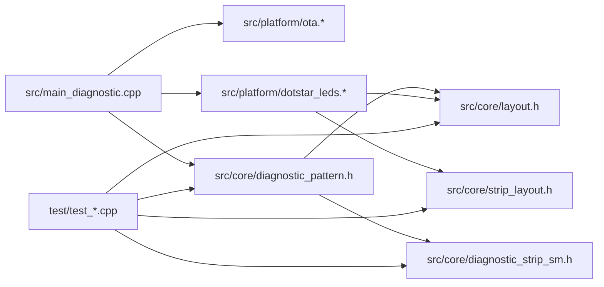
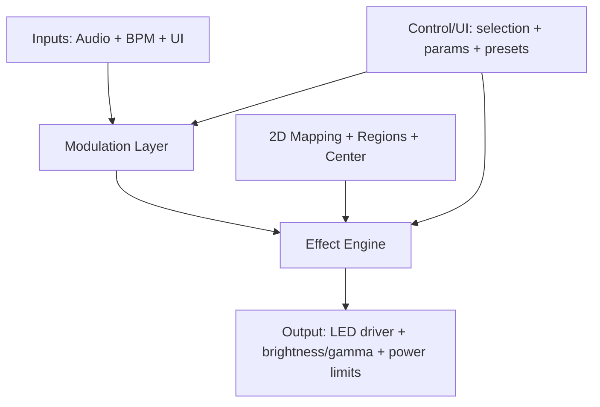

# WLED Integration Pre-Plan (Chromance Control)

This document is a pre-planning architecture review for integrating WLED into this repository (or replacing the current firmware with WLED), while enabling a future library of effects, a 2D physical mapping system, and sensor-driven modulation (sound + biofeedback/heartbeat).

## A. Executive summary

### What exists today (as-is)

This repo currently contains a focused “diagnostic + OTA” firmware for an ESP32 Feather that drives **4 independent APA102/DotStar strips** (total **560 LEDs**) and supports **ArduinoOTA**.

Key characteristics:
- **Two-layer split**: Arduino-independent “core” logic under `src/core/**` and Arduino/platform integration under `src/platform/**`.
- **Single pattern**: a diagnostic pattern/state machine (`src/core/diagnostic_pattern.h`, `src/core/diagnostic_strip_sm.h`) rendered via a tiny renderer interface into a DotStar platform driver (`src/platform/dotstar_leds.*`).
- **Compile-time hardware config**: strip segment counts, pins, and per-strip diagnostic colors in `src/core/layout.h` with `static_assert` validation.
- **WiFi credentials are compile-time** (env-driven via `scripts/wifi_from_env.py` or local `include/wifi_secrets.h`), and OTA is serviced cooperatively in the main loop (`src/platform/ota.*`, `src/main_diagnostic.cpp`).
- **Host unit tests exist** for layout + mapping + state machine behavior via `pio test -e native` (`test/test_*.cpp`).

What’s missing relative to the desired next phase:
- No general **pattern/effect registry**, parameter system, transitions, palettes, or preset storage.
- No **2D physical mapping** abstraction (only “segment index → linear LED range” exists via `src/core/strip_layout.h`).
- No inputs beyond WiFi/OTA: **no audio**, **no heartbeat**, no control/UI beyond ArduinoOTA.

### What we want next

We want an architecture that supports:
- A growing **library of effects**, including the initial “breath comets” effect.
- A robust **irregular 2D mapping** model (holes, non-rectangular shapes, serpentine wiring) with a well-defined **center** and optional named regions.
- A **modulation layer** that turns sensors (audio features + BPM) into normalized control signals usable by effects.
- A control/UI story (potentially WLED’s UI), without sacrificing determinism or maintainability.

### Key architectural decision

The decision is less about “can we run WLED?” and more about where the long-term ownership boundary lives:
- Do we adopt WLED as the *product surface* (UI, networking, presets, effect library) and extend it via WLED’s extension points?
- Or do we keep this repo’s clean, testable “core engine” and only interoperate with WLED-compatible protocols/UI?

### Recommendation (preliminary)

**Recommend a short spike to de-risk Option B (full WLED) and Option C (interop) before committing.**

If the spike shows WLED fits comfortably on this hardware with 4 DotStar outputs *and* the required 2D mapping + audio path is acceptable, **Option B** will likely deliver the fastest path to a polished control/UI and a rich baseline effect library.

If WLED proves too monolithic for maintainability, too tight on flash/RAM, or too constraining for irregular 2D mapping + biofeedback workflows, choose **Option C**: keep a custom core engine (this repo’s direction) and add **WLED-compatible control surfaces** (protocol compatibility and/or a minimal subset of WLED’s APIs).

### Open questions (impact A/B/C decision)

- **4× APA102/DotStar outputs under WLED**: feasibility, stability, and performance (multi-bus + SPI clocking + timing).
- **Control/UI direction**: adopt WLED UI/presets vs keep a custom control plane (and what interop surface we need either way).
- **Mapping + preset storage/versioning**: where mapping lives (filesystem vs embedded vs generated at build time), how it’s versioned, and how presets reference mapping revisions.

### Measurable spike success criteria (pass/fail)

The spike should produce numbers, not impressions:
- **Heap headroom**: ≥ **80 KB free heap** at idle with WiFi + UI/control plane enabled (measure repeatedly over ~60s).
- **Frame stability**: stable animation at **≥ 30 FPS** (or configured target FPS) without visible stutter over ~5 minutes.
- **Signal integrity**: no random flicker/data corruption across all 4 strips at the chosen SPI clock (run for ~10 minutes).
- **Output correctness**: all 560 LEDs respond deterministically; no “cross-talk” where one strip’s updates corrupt another.
- **Mapping correctness**: `ledmap.json` validated by the mapping test patterns described in “Mapping Validation Patterns”.

## B. Current architecture overview (as-is)

### B1. Build/deploy targets

- PlatformIO environments are defined in `platformio.ini`:
  - `env:diagnostic` (ESP32 firmware; default)
  - `env:native` (host unit tests; Unity)
- WiFi credentials are injected at build time via `scripts/wifi_from_env.py` (preferred) or provided locally in `include/wifi_secrets.h` (gitignored via `.gitignore`).
- OTA-capable partition scheme is configured via `board_build.partitions = min_spiffs.csv` in `platformio.ini`.

### B2. Module boundaries



Constraints are enforced by convention and structure:
- `src/core/**` is Arduino-free and testable on host.
- `src/platform/**` may include Arduino headers and owns IO (WiFi/OTA and LEDs).

### B3. Main loop / frame pipeline

The firmware entrypoint is `src/main_diagnostic.cpp`.

Pipeline:
1. `setup()` initializes Serial, LEDs, OTA, and the diagnostic pattern, then marks the OTA image valid when possible.
2. `loop()` continuously services OTA, advances the pattern state machine based on `millis()`, and renders at a fixed frame cadence.

```mermaid
sequenceDiagram
  participant Loop as loop()
  participant OTA as OtaManager
  participant Pat as DiagnosticPattern
  participant Leds as DotstarLeds

  Loop->>OTA: handle()
  Loop->>Pat: tick(now_ms)
  alt frame due
    Loop->>Pat: render(Leds)
    Loop->>Leds: show_all()
  else frame not due
    Loop-->>Loop: return
  end
```

Frame timing:
- Default render cadence is `kFrameMs = 20` (50 FPS) in `src/main_diagnostic.cpp`.
- During OTA transfers, cadence is reduced (`ota.is_updating() ? 100 : kFrameMs`) to reduce contention (`src/main_diagnostic.cpp`).

FPS configurability decision (to carry forward):
- In **our firmware**, runtime-configurable FPS is straightforward and recommended: implement a `target_fps` scheduler where `target_fps = 0` means “uncapped”, otherwise render on `frame_period_ms = 1000/target_fps`.
- In **stock WLED**, the effective FPS is typically governed by a fixed main loop cadence and internal scheduling; treat “explicit runtime FPS control” as a tradeoff/limitation unless we confirm an existing config hook.

### B4. Pattern/effect model (today)

There is currently only a diagnostic “pattern”:
- `chromance::core::DiagnosticPattern` orchestrates global phases and 4 per-strip state machines (`src/core/diagnostic_pattern.h`).
- `chromance::core::DiagnosticStripStateMachine` models per-strip progress (`src/core/diagnostic_strip_sm.h`).

Rendering is “intent-based”:
- Core does not compute a full pixel buffer; it calls a renderer interface (`chromance::core::IDiagnosticRenderer`) with segment-level operations (`src/core/diagnostic_pattern.h`).
- Platform implements that interface (`chromance::platform::DotstarLeds`) and translates segment intent into `Adafruit_DotStar::setPixelColor()` calls (`src/platform/dotstar_leds.*`).

### B5. Data model (today)

- Color is a small POD `Rgb {uint8_t r,g,b;}` in `src/core/types.h`.
- Hardware layout and diagnostic defaults are compile-time constants in `src/core/layout.h`:
  - segment counts per strip (11/12/6/11)
  - pins per strip (DATA/CLOCK pairs)
  - diagnostic colors per strip
  - diagnostic brightness cap (`kDiagnosticBrightness`)
- The only mapping abstraction is **segment indexing**:
  - `segment_start_led(strip, segment_index)` and `strip_led_count(strip)` in `src/core/strip_layout.h`.

No palettes, gamma, power limiting, dimming curves, or blending model exists yet.

### B6. Inputs (today)

- WiFi STA mode is used only to support ArduinoOTA (`src/platform/ota.cpp`).
- No audio, no heartbeat/biofeedback, no BLE, no UI besides OTA hostname.

### B7. Testing (today)

Host-side Unity tests exist and validate “core” logic only:
- Layout/segment counts: `test/test_layout.cpp`
- Segment-to-LED mapping: `test/test_segments.cpp`
- Diagnostic state machine and orchestration phases: `test/test_diagnostic_pattern.cpp`

## C. Constraints & design goals (next phase)

### Hardware/software constraints (assumptions to validate)

- MCU: ESP32 Feather-class, 4MB flash (from project prompt in `chromance_control_prompt.md`).
- LEDs: 560 total APA102/DotStar pixels across 4 independent outputs (`src/core/layout.h`).
- Frame rate target: 30–60 FPS typical; must remain smooth under network/UI load.
- Reliability: avoid long blocking operations; service OTA/network frequently; avoid watchdog resets.

### Design goals

- **Determinism**: predictable frame pacing; bounded per-frame work; no heap churn in hot paths.
- **Extensibility**: add new effects + modulators + mapping variants without touching platform IO code.
- **Maintainability**: clear boundaries; avoid deep, hard-to-rebase forks when possible.
- **Observability/debuggability**: consistent logging, effect introspection, and safe fallback modes.

## D. Integration options (A/B/C) with tradeoffs

### Decision criteria (what to measure during a spike)

1. **Flash/RAM headroom** with 4 APA102 outputs enabled and any desired networking/UI features.
2. **2D mapping fit** for an irregular layout (holes, regions, “center”, multi-strip wiring).
3. **Audio + biofeedback ingestion**: availability of an audio pipeline; how a BPM signal enters the runtime.
4. **Effect authoring ergonomics**: ability to implement “breath comets” cleanly and testably.
5. **Upstream compatibility** (if WLED is used): how invasive changes must be.

### Option A: WLED as a “sister module” (embed/interop, keep current core)

Concept:
- Keep this repo’s core engine (mapping + effects + modulation).
- Pull selected WLED components (control/UI, preset storage, network APIs) into this firmware, or provide a thin compatibility layer that behaves like WLED from the outside.

What we keep vs replace:
- Keep: `src/core/**` approach (Arduino-free logic + tests), custom mapping engine, custom effect library.
- Replace/augment: networking/control plane; potentially adopt WLED’s web UI + JSON APIs if feasible.

Pros:
- Preserves testability and architectural cleanliness.
- Allows a mapping model optimized for irregular installations (not only grid matrices).

Cons / risks:
- WLED is not designed as a small embeddable library; extracting subsystems tends to create a **hard fork** anyway.
- High integration complexity (global state, build system assumptions, tight coupling across WLED modules).

First milestone:
- Implement *one* control surface compatible with WLED expectations (e.g., basic “realtime pixel stream in” or a minimal subset of JSON API) while keeping the current output/mapping/effect pipeline intact.

### Option B: Replace everything with WLED (fork / upstream-friendly)

Concept:
- Adopt WLED as the base firmware.
- Implement “breath comets” as a custom WLED effect.
- Implement irregular 2D mapping via WLED’s 2D mapping features (or extend them).
- Add audio-reactive and biofeedback ingestion via WLED usermods (or a small core patch if necessary).

What we keep vs replace:
- Replace almost all current firmware modules (`src/**`) with WLED’s structure.
- Keep only hardware facts (LED counts, pin assignments) and potentially reuse mapping generation assets (`chromance_layout.svg`, `chromance_master_40_with_direction.svg`).

Pros:
- Full-featured UI, presets, networking, OTA, and a large existing effect library “for free”.
- Community-tested behavior around control surfaces and effect parameter editing.

Cons / risks:
- Harder to preserve the repo’s current “core is Arduino-free and unit tested” architecture; WLED is not organized for host-unit-tests.
- Larger flash/RAM footprint; feature creep can reduce determinism.
- Irregular mapping may require deeper WLED changes than desired if WLED’s 2D model assumes grids/matrices.

First milestone:
- Build WLED for `featheresp32` with **4 APA102 busses** and confirm:
  - stable 30–60 FPS with 560 LEDs
  - OTA + WiFi stability
  - 2D mapping feasibility for non-rectangular layout

### Option C: Hybrid / external control (keep our firmware, add WLED-compatible protocols)

Concept:
- Keep this repo’s firmware as the primary engine (effects + mapping + modulation).
- Add compatibility layers so WLED apps/controllers can drive it:
  - Accept WLED realtime protocols (pixel streaming) for “external control” mode, and/or
  - Implement a small REST/UDP control plane inspired by WLED (without importing WLED code).

What we keep vs replace:
- Keep: core/pattern/mapping/modulation architecture and unit tests.
- Add: a control plane and preset storage (NVS/flash), plus optional WLED protocol compatibility.

Pros:
- Maintains clean architecture and strong testing story.
- Lets the project evolve a mapping model tailored to this physical installation.

Cons / risks:
- More implementation work than “just use WLED” to reach parity with UI/presets/networking.
- Requires careful definition of the control schema (parameters, presets, transitions) to avoid reinventing a worse WLED.

First milestone:
- Implement “effect selection + parameters + presets” via a minimal control interface (even serial first), and optionally add one WLED-compatible realtime stream mode for interop.

Control plane + presets (to avoid “accidental reimplementation of WLED”):
- Define a **minimal preset schema now**, even if Option B later replaces it with WLED presets.
- Require explicit **versioning** so presets remain loadable across mapping changes.
- Suggested minimal preset JSON fields:
  - `schemaVersion` (integer)
  - `mappingId` (string; e.g. `chromance-v1`)
  - `effectId` (string)
  - `paletteId` (string or integer)
  - `brightness` (0–255)
  - `speed` (0–255)
  - `intensity` (0–255)
  - `targetFps` (0 = uncapped, else FPS)
  - `regions` (optional; list of region IDs/names to affect)

### Comparison table

| Dimension | Option A (embed/interop) | Option B (replace w/ WLED) | Option C (hybrid/interop) |
|---|---|---|---|
| Time-to-polished UI | Medium/Low (hard extraction) | High (WLED already has it) | Medium (build our own or partial compatibility) |
| Testability (host unit tests) | High | Low/Medium | High |
| Upstream friendliness | Low/Medium | Medium/High (if done via usermods/effects) | High (no fork) |
| 2D irregular mapping fit | High (custom) | Medium (depends on WLED model) | High (custom) |
| Audio reactive path | Medium (build/integrate) | High (if WLED audio path fits) | Medium (build/integrate) |
| Flash/RAM risk | Medium | High | Medium |

## E. Proposed target architecture (to-be)

Regardless of A/B/C, the long-term architecture should converge on these layers:



### Key interfaces/types (pseudo-code)

Effect core (“pure-ish”):
```cpp
struct FrameTime { uint32_t now_ms; float dt_s; };
struct ModSignals { float audio_level; float audio_beat; float bpm; float breath_phase; /* 0..1 */ };
struct EffectParams { /* schema-driven */ };

struct Pixel { uint8_t r,g,b; };
using PixelSpan = span<Pixel>;

class Mapping2D {
 public:
  uint16_t led_count() const;
  bool index_to_xy(uint16_t i, int16_t& x, int16_t& y) const;
  uint16_t xy_to_index(int16_t x, int16_t y) const; // returns kNoLed for holes
  int16_t center_x() const;
  int16_t center_y() const;
  float radius_norm(uint16_t i) const; // precomputed distance-to-center normalized
  uint16_t region_id(uint16_t i) const;
};

class Effect {
 public:
  virtual void render(const FrameTime&, const Mapping2D&, const ModSignals&, const EffectParams&, PixelSpan out) = 0;
};
```

Notes:
- The mapping layer should expose both **coordinate** and **precomputed fields** (e.g., normalized radius) so effects can be simple and fast.
- The output layer can apply brightness/gamma/power limits after effects produce pixels.

Threading/RTOS assumptions:
- Prefer single-threaded cooperative loop initially (like today).
- If audio FFT requires separate sampling, isolate it into a task that produces features at a fixed cadence and communicates via lock-free/atomic snapshot buffers.

Configuration/presets:
- Store effect selection + parameters + mapping selection + input routing as structured data (JSON-like schema).
- If WLED is chosen, lean on WLED’s preset model; otherwise define a small stable schema early.

## F. Mapping model specification (irregular 2D)

This section has two goals:
1) Define a mapping model that works for our custom engine (index ↔ coordinate + fields).
2) Define an explicit, deterministic process to generate a **WLED-compatible** `ledmap.json` for Chromance.

### Requirements recap

The mapping must support:
- irregular shapes, holes, gaps, non-rectangular topologies
- serpentine rows and arbitrary wiring order
- (x,y) → LED index and LED index → (x,y)
- a stable “center” concept and optional named regions
- future multi-panel/multi-strip expansion

### Proposed representation (engine-level)

Use a **coordinate table per LED** plus an **optional dense XY lookup table** when the layout is grid-like:

1) Index → coordinate (always present):
```cpp
struct LedCoord { int16_t x; int16_t y; uint16_t region; };
constexpr LedCoord kLedCoords[LED_COUNT] = { /* generated */ };
```

2) Coordinate → index (optional; generated when a grid exists):
```cpp
constexpr uint16_t kNoLed = 0xFFFF;
constexpr uint16_t kXYToIndex[HEIGHT][WIDTH] = { /* kNoLed for holes */ };
```

Center and distance fields:
- Store `center_x/center_y` explicitly (do not infer every frame).
- Precompute normalized radius per LED (`radius_norm[i]`) and optionally angle (`theta_norm[i]`) to make radial and swirl effects cheap.

Regions:
- `region` can be “strip/segment” derived or higher-level named regions (e.g., “left wing”, “center spine”).
- Keep the region IDs stable over time; map names to IDs in config/UI.

### Generating/validating the mapping

Existing assets in this repo can seed mapping generation:
- `chromance_layout.svg`
- `chromance_master_40_with_direction.svg`
- `chromance_layout.png`

Proposed workflow:
1. Author a canonical set of LED points/segment points in SVG (or export a list).
2. Generate:
   - `kLedCoords[]` table (index → x,y,region)
   - optional `kXYToIndex[][]` dense map (for grid effects)
   - derived fields (radius/angle) and validation checks (bounds, uniqueness).
3. Validate by producing:
   - a rendered preview image (tool-side) with indices and regions
   - a compile-time checksum or runtime assert in debug builds

If WLED is adopted (Option B), align generation output with WLED’s expected 2D map format (so the same source-of-truth mapping can be emitted in both “our core header” and “WLED map” formats).

### F2. Chromance 2D Mapping (WLED `ledmap.json`)

#### F2.1 Vertex grid definition

Confirmed facts from the repository geometry (`chromance_layout.svg`):
- Vertex lattice is **7 columns × 9 rows** of vertices ⇒ **63 possible vertex positions**.
- Use vertex coordinates:
  - `vx = 0..6` (columns)
  - `vy = 0..8` (rows)
- Terminology: “steps”, “rows”, and “columns” are treated as interchangeable for this vertex grid.

We distinguish:
- **Vertex coords**: `(vx, vy)` addressing positions in the 7×9 vertex lattice.
- **Pixel coords**: `(x, y)` integer raster coordinates used by WLED’s rectangular map.

Notes:
- The segment list uses a **subset** of the 63 lattice points; the exact used-vertex count can be derived from the segment list.
- The 40-segment endpoint set uses **25 unique vertices (derived by counting unique endpoints in the segment list).**

#### F2.2 Segment topology list (endpoints in vertex coords)

Use this exact list of 40 undirected edges (direction is supplied later by wiring order):

1. (0,1)-(0,3)  
2. (0,1)-(1,0)  
3. (0,1)-(1,2)  
4. (0,3)-(1,4)  
5. (1,0)-(2,1)  
6. (1,2)-(1,4)  
7. (1,2)-(2,1)  
8. (1,4)-(1,6)  
9. (1,4)-(2,3)  
10. (1,4)-(2,5)  
11. (1,6)-(2,7)  
12. (2,1)-(2,3)  
13. (2,1)-(3,0)  
14. (2,1)-(3,2)  
15. (2,3)-(3,4)  
16. (2,5)-(2,7)  
17. (2,5)-(3,4)  
18. (2,7)-(3,6)  
19. (2,7)-(3,8)  
20. (3,6)-(3,4)  
21. (3,6)-(4,7)  
22. (3,8)-(4,7)  
23. (3,0)-(4,1)  
24. (3,2)-(3,4)  
25. (3,2)-(4,1)  
26. (3,4)-(4,3)  
27. (3,4)-(4,5)  
28. (4,1)-(4,3)  
29. (4,1)-(5,0)  
30. (4,1)-(5,2)  
31. (4,3)-(5,4)  
32. (4,5)-(4,7)  
33. (4,5)-(5,4)  
34. (4,7)-(5,6)  
35. (5,6)-(5,4)  
36. (5,0)-(6,1)  
37. (5,2)-(5,4)  
38. (5,2)-(6,1)  
39. (5,4)-(6,3)  
40. (6,1)-(6,3)

#### F2.3 Canonical mapping artifacts (recommended)

Treat mapping as a versioned artifact pipeline:
- `chromance_layout.svg` (authoring source)
- `mapping/segments.json` (40 segments with endpoints in vertex coords; may also store derived pixel coords)
- `mapping/wiring.json` (strip → ordered segments + direction; source-of-truth for LED index order)
- generated `mapping/ledmap.json` (WLED custom 2D map)
- generated `mapping/pixels.json` (optional richer map for our engine: `ledIndex -> (x,y)` + derived fields)

Repo grounding:
- This repository currently has geometry (`chromance_layout.svg`, `chromance_master_40_with_direction.svg`) but does **not** yet contain a `mapping/wiring.json` source-of-truth. The existing firmware (`src/core/layout.h`) only encodes per-strip segment counts and GPIO pins, not the per-segment wiring order across the 40 edges.
- `src/core/layout.h` confirms the segments are split across 4 strips as **11/12/6/11** segments (`kStrip0Segments..kStrip3Segments` and `kStripConfigs`), and the generator must respect the real strip→segment distribution and ordering.

Optional helper (supports generation):
- `scripts/generate_ledmap.py` reads `mapping/wiring.json` (strip order + per-segment direction) and writes `mapping/ledmap.json` (and optionally `mapping/pixels.json`).
- It validates core invariants during generation (segment coverage, collisions) and prints `width/height/holes` for quick inspection.
- Example usage:
  - `python3 scripts/generate_ledmap.py --wiring mapping/wiring.json --out-ledmap mapping/ledmap.json --out-pixels mapping/pixels.json`

Important: `mapping/wiring.json` is **required** to generate `ledmap.json`.
- `mapping/wiring.json` is authoritative for:
  - strip ordering across the 4 strips
  - segment order within each strip
  - segment direction (A→B vs B→A) for LED index assignment
- The generator currently expects direction strings `a_to_b` and `b_to_a` (see `scripts/generate_ledmap.py`).

#### F2.4 Projection from vertex coords to integer raster coords

Goal: a deterministic `ledmap.json` grid size and pixel placement derived from the vertex grid + segment list + wiring order.

Default projection (initial, adjustable after visual tests):
- `X = 28 * vx`
- `Y = 14 * vy`

Rationale:
- Keeps the 60° segment directions visually coherent on an integer grid.
- Ties segment scale to the physical “14 LEDs per segment” constraint.

Placing 14 LEDs on each segment without collisions at vertices:
- For each segment endpoints `(X0,Y0) -> (X1,Y1)`, place 14 sample points using a half-step so we do **not** land on shared vertices:
  - For `k = 0..13`:
    - `t = (k + 0.5) / 14`
    - `x = round(X0 + t*(X1 - X0))`
    - `y = round(Y0 + t*(Y1 - Y0))`

Computing minimal ledmap bounds:
1) Generate all 560 `(x,y)` points first (segment topology + wiring order determines LED index assignment).
2) Compute:
   - `min_x`, `max_x`, `min_y`, `max_y`
   - `width = max_x - min_x + 1`
   - `height = max_y - min_y + 1`
3) Normalize: `x' = x - min_x`, `y' = y - min_y` so all coords are ≥ 0.

WLED `ledmap.json` fill (row-major):
- Initialize `map = [-1] * (width * height)`
- For each LED index `i` with coord `(x', y')`:
  - `map[x' + y' * width] = i`

Collision rule:
- If two LEDs map to the same `(x',y')` cell, treat it as a bug.
- Resolve by adjusting projection scale constants (e.g., increase `X` scale) and/or stepping scheme.

#### F2.5 Mapping Invariants & Validation

Mapping invariants (must hold for generated artifacts):
1) Exactly **560 LEDs**: indices **0..559**.
2) Each LED index appears **exactly once** in the produced mapping (no duplicates, no gaps).
3) Each occupied cell in `ledmap.json` maps to a **valid** LED index.
4) Collisions are not allowed: no two LEDs share the same `(x,y)` cell.
5) All mapped `(x,y)` are within computed bounds; bounds are minimal after normalization.
6) `map.length == width*height`.
7) Exact segment coverage: all **40 segment IDs** appear **exactly once** in the wiring order; the set of IDs must match `{1..40}`. If this fails, both `ledmap.json` and `pixels.json` are invalid.

Recommended validation steps:
- Add a small unit test (host-side) that loads `mapping/ledmap.json` and enforces the invariants above.
- Use an optional CLI/script to print collision reports + bounds + coverage stats (the included `scripts/generate_ledmap.py` already fails on collisions and prints `width/height/holes`).
- Make generated JSON diff-friendly with stable ordering/formatting (e.g., `indent=2`, newline at EOF, and avoid nondeterministic key ordering).

#### F2.6 Mapping Validation Patterns

Once `ledmap.json` exists and is loaded into WLED (or our engine), validate with two intentionally simple patterns.

##### XY_Scan_Test

Behavior:
- Iterate `y = 0..height-1`, `x = 0..width-1`.
- If `map[x + y*width] != -1`, briefly light that LED index, then move on.

Purpose:
- Confirm spatial continuity, axis orientation, and holes handling.
- Detect “teleporting” (adjacent grid cells mapping to far-apart physical LEDs).

##### Coord_Color_Test

Behavior:
- Color each LED based on normalized coordinates:
  - `R = x_norm`, `G = y_norm`
  - Optional `B = distance_to_center_norm`

Purpose:
- Instantly catch flips/swaps (left-right, top-bottom), scaling issues, and mapping discontinuities.

Acceptance criteria:
- Every physical LED lights exactly once in the scan (no missing LEDs).
- Gradient directions match expectations (left/right and top/bottom).
- No teleporting behavior during scan (local continuity looks local).

#### F2.7 Mapping Generator (generate_ledmap.py) — Inputs/Outputs

This repo includes a concrete generator at `scripts/generate_ledmap.py`. The plan in this document should match what that script actually expects/produces.

Inputs:
- Segment topology: currently embedded as the `SEGMENTS` list in `scripts/generate_ledmap.py` (and should remain consistent with the segment list in this doc and/or a future `mapping/segments.json`).
- `mapping/wiring.json` (required): strip ordering, per-strip segment ordering, and per-segment direction (`a_to_b` / `b_to_a`).

Outputs:
- `mapping/ledmap.json` (WLED custom 2D map):
  - `{ "width": <int>, "height": <int>, "map": [ ... ] }`
  - `map` is row-major length `width*height`, entries are LED index or `-1` for holes.
- `mapping/pixels.json` (optional):
  - `{ "width": <int>, "height": <int>, "pixels": [{"i":0,"x":..,"y":..}, ...] }`
  - Each `i` is LED index; `(x,y)` is the normalized coordinate (origin shifted to (0,0)).

Normalization:
- The generator computes bounds over all 560 sampled points, then subtracts `(min_x, min_y)` so all coordinates start at (0,0).

Collision policy:
- Any collision (two LEDs assigned to the same `(x,y)` cell) is a fatal error.

Recommended enhancements (doc-only; do not implement in this task):
- Add richer pixels metadata: `strip`, `seg`, `k` (0..13 within segment), `dir`.
- Add CLI flags: `--x-scale`, `--y-scale`, `--flip-x`, `--flip-y`, `--t-offset` (to tune projection and sampling deterministically).
- Add `--validate-only` mode to validate an existing `mapping/ledmap.json`/`mapping/pixels.json` against invariants.
- Add optional preview image output (scatter PNG) for quick geometry sanity checks.

#### F2.8 Verifying `ledmap.json` is Valid & Representative

Treat “valid” (invariants hold) and “representative” (effects look correct) as separate gates.

1) Programmatic validity (hard gate)
- JSON schema loads; `width`/`height` are positive integers; `map.length == width*height`.
- Exactly **560** non-`-1` cells.
- Every LED index `0..559` appears **exactly once**.
- Every occupied cell contains a valid LED index.
- No collisions; bounds are minimal after normalization.
- All segment IDs `{1..40}` appear exactly once in `mapping/wiring.json`.

2) Geometric representativeness (visual gate)
- Render the map silhouette (scatter plot of all mapped `(x,y)` from `mapping/pixels.json` or occupied cells from `mapping/ledmap.json`).
- The silhouette should match the Chromance geometry from `chromance_layout.svg` in a recognizable way (correct overall proportions, symmetry, and “holes”).

3) Physical validation (on-device/WLED gate)
- Run `Coord_Color_Test` and confirm gradient orientation matches expectations (left/right, top/bottom) and “center” looks plausible.
- Run `XY_Scan_Test` and confirm no teleporting and no missing LEDs.
- Optional `Index_Walk_Test`: increment LED index 0→559 and ensure the lit pixel walks along the expected wiring continuity (good at catching `mapping/wiring.json` ordering mistakes).

Acceptance criteria:
- Every LED index `0..559` appears exactly once.
- Exactly 560 non-`-1` cells.
- Gradients are oriented correctly.
- No teleporting during XY scan.
- Index-walk matches expected wiring continuity (no unexpected jumps).

## G. Web Simulator (Optional, High Leverage)

Goal: validate mapping + effects quickly in a browser without building the full firmware and without requiring WLED to be the execution environment.

Scope boundary:
- Compile only a portable **effects core** to WASM (no WiFi/OTA/drivers).
- Treat mapping artifacts as inputs; do not embed hardware assumptions in the simulator.

Inputs/outputs:
- Inputs:
  - `timeMs`
  - `effectId`
  - `params` (binary blob or JSON)
  - mapping (prefer `mapping/pixels.json`: `ledIndex -> (x,y)`)
- Output:
  - RGB buffer length **560** (one RGB triplet per LED index 0..559)

Mapping reuse:
- Prefer `mapping/pixels.json` as the simulator’s source-of-truth (`ledIndex -> x,y`).
- Keep `mapping/ledmap.json` as the WLED-specific artifact (grid with holes).

Two runtime modes:
1) **Local WASM sim**: effects run in-browser; renderer draws the 560 points at `(x,y)`.
2) **Live device preview**: browser renders frames streamed from a device (similar to a “peek/liveview” concept), useful for verifying timing and driver-level artifacts while reusing the same viewer.

Minimal ABI (keep stable and boring):
- `init(ledCount)`
- `setMapping(coordsPacked)` (e.g., `int16` x/y pairs, or JSON unpacked once)
- `setParams(effectId, paramsBlob)`
- `render(timeMs)` → writes into an RGB buffer exposed to JS

Rendering:
- Draw 560 points via Canvas (or SVG) at `(x,y)`; optionally draw faint segment lines for debugging.
- Include an FPS knob: simulator throttles to `target_fps` or runs uncapped (`target_fps=0`).

Roadmap placement:
- After mapping artifacts are stable, build the simulator viewer and implement the two mapping validation patterns (`XY_Scan_Test`, `Coord_Color_Test`) in the simulator first, then port the same tests/patterns to WLED or firmware.

## H. Effect authoring guide (future)

### Breath comets effect (behavioral decomposition)

Define a control signal `breath_phase` in [0,1):
- 0.0 → start inhale (inward motion toward center)
- 0.5 → transition to exhale (outward motion from center)

Comets can be expressed in mapping terms:
- Inhale: particles move down the radius field toward `radius_norm = 0`
- Exhale: particles move up the radius field toward `radius_norm = 1`

This effect becomes straightforward if the mapping provides:
- `radius_norm[i]`
- optional `theta_norm[i]` or neighborhood adjacency for smoothing

### Adding new effects

Recommended structure (whether WLED-based or custom):
- One file per effect.
- A stable parameter schema (name, range, default, units).
- Deterministic render given `(time, params, modulation signals, mapping)`.

Testing strategy:
- Unit tests for mapping invariants (bijective where expected, holes handled).
- Snapshot tests for effects:
  - fixed seed + fixed time + fixed modulation inputs → pixel checksum or small set of sampled pixels.
  - avoid reliance on exact millisecond timing; test invariants and phase relationships.

If WLED is used:
- Keep effect math in a small, testable helper module when possible, and adapt it to WLED’s effect entrypoint.

## I. Implementation roadmap

### Milestone 1 — WLED feasibility spike (1–3 days)

Deliverables:
- Build a WLED firmware for the target board and confirm basic operation with APA102/DotStar output.
- Validate multi-output configuration (4 busses / strips).
- Measure flash/RAM headroom and frame rate at 560 LEDs.
- Validate whether WLED’s 2D mapping can express the installation shape.
- Validate audio-reactive feasibility on the hardware (even if only compiles at first).

WLED-specific spike item (multi-bus index space):
- Confirm WLED’s handling of **4 output busses** yields a single contiguous LED index space compatible with `ledmap.json` indices **0..559**, or document the per-bus index assignment rules and ensure the generated map aligns to them.

Decision output:
- Choose A/B/C based on measured headroom and mapping/audio fit.

#### APA102/DotStar multi-output feasibility (spike focus)

Repo grounding (today):
- The current firmware drives APA102 via `Adafruit_DotStar` (`src/platform/dotstar_leds.*`).
- It constructs each strip with explicit data/clock GPIO pins (`new Adafruit_DotStar(count, data_pin, clock_pin, order)`), which **often** selects software/bit-banged output in Adafruit’s DotStar library; hardware SPI is typically used via constructors that omit pins (or accept an `SPI` object). Treat this as an assumption to verify on the exact library/version in use.

What we will measure during the spike:
- `flush_ms`: time spent pushing LED data per strip and in total (e.g., around `show()` calls).
- `frame_ms`: end-to-end frame time under WiFi/UI load.
- Stability at multiple “SPI clock” equivalents (or WLED bus timing settings) across all 4 strips.

Confirmations (do early in spike):
- Verify hardware SPI vs software SPI for each of the 4 strips by inspecting `src/platform/dotstar_leds.cpp` and/or measuring CPU time spent in `show()`/flush.

Test configurations (run each for ~10 minutes):
- **Conservative**: slowest stable bus speed / most generous timing.
- **Medium**: typical APA102 clock for 560 LEDs (expected daily-use setting).
- **Aggressive**: highest plausible clock before errors appear.

Success criteria for “4 strips working” under WLED:
- All 4 busses update correctly and independently (no corruption or cross-talk).
- No flicker during continuous animations + UI/network traffic.
- Performance remains stable (no progressive heap drop, no watchdog resets).

### Milestone 2 — Mapping source of truth (tooling + runtime) (3–7 days)

Deliverables:
- Define canonical mapping data model (coords + regions + center).
- Generate runtime mapping tables and validate with visualization tooling.
- Provide a small “mapping preview” debug mode in firmware (optional).

### Milestone 3 — Modulation layer (audio + BPM scaffolding) (5–10 days)

Deliverables:
- Audio feature pipeline (at least envelope + beat; FFT optional).
- BPM ingestion interface with pluggable transports (serial/UDP/BLE/analog) and a stable normalized signal.
- Produce `ModSignals` snapshot each frame with clear timing semantics.

### Milestone 4 — First real effect: breath comets (5–10 days)

Deliverables:
- Implement the breath comets effect on the mapping model.
- Parameter schema and a minimal control surface for tuning (WLED UI or custom).
- Deterministic tests for core math (where feasible).

### Milestone 5 — Presets, transitions, and robustness (ongoing)

Deliverables:
- Preset storage and recall (WLED presets or custom NVS schema).
- Cross-fade transitions between effects.
- Performance and stability hardening: watchdog-safe, bounded work, OTA safety preserved.
