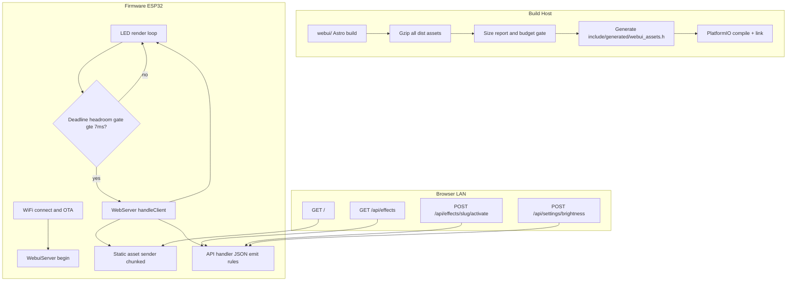
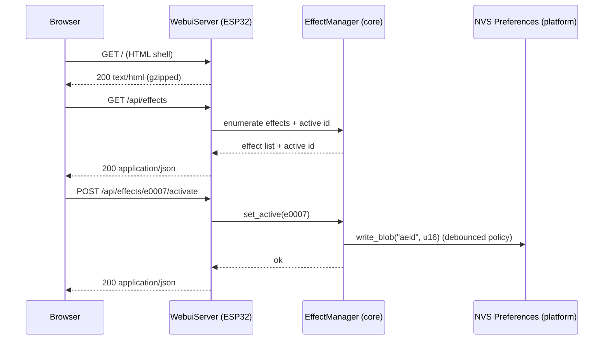
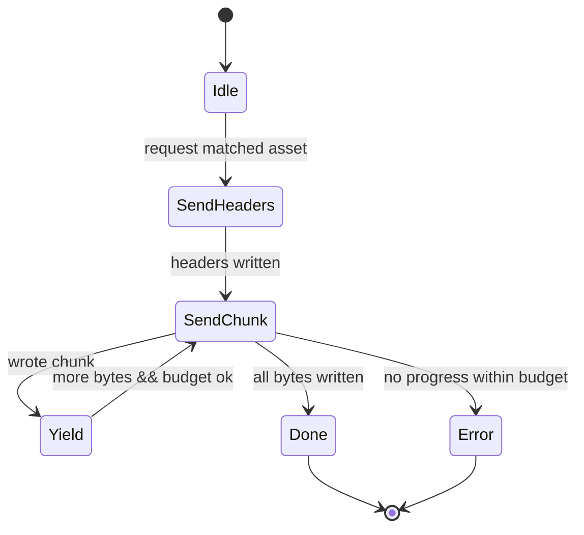

# Web UI (Firmware-hosted) — Design Document + Comprehensive Implementation Plan

This document is **binding** and derives all requirements from `docs/plans/webui_preplan.md`.
It produces a complete design + direct implementation plan (including code) for a firmware-hosted Web UI.

Target (non-negotiable): **ESP32 Feather HUZZAH32**, 4MB flash, OTA enabled.

---

## 1. Executive Summary

This design adds a firmware-hosted Web UI to Chromance Control with:
- Static, gzipped assets built offline (Astro + Tailwind + single-theme daisyUI + minimal Preact islands) and embedded into the firmware image.
- A small JSON API served by an Arduino synchronous `WebServer`.
- Strict safeguards so HTTP work does not starve the LED render loop (deadline headroom gate, time budgets, global rate limiting, bounded RAM).
- A fixed persistence model aligned with the existing effect/config system: one 64-byte blob per effect (`eXXXX`) + globals (`aeid`, `bright_pct`, `mode`), with per-effect selector UI only.

Key architectural principles:
- **Hot path vs cold path**: rendering remains allocation-free and side-effect-free; all web/network/persistence is cold path only.
- **Predictable memory**: strict caps on HTTP body size and JSON response size; streaming/chunked emission rules; no unbounded `String` concatenation.
- **OTA safety**: partition scheme explicitly selected (`min_spiffs.csv`) and binary size checks enforced; embedded UI asset budget (200KB warn, 300KB fail gzipped total).

Highest-risk areas and mitigations:
- Risk: HTTP traffic blocks rendering (TCP writes can block). Mitigation: loop-level deadline gate (≥7ms headroom), chunked asset sending (>1024 bytes), and strict per-request CPU budgets with fail-fast behavior.
- Risk: asset bloat breaks OTA/app size. Mitigation: always-on gzipped asset budget enforcement + OTA safety margin check at build time.
- Risk: heap churn from `String` usage in JSON. Mitigation: streaming writer for large endpoints, bounded-buffer responses elsewhere, explicit “no unbounded concat” rule.

---

## 2. System Architecture Overview

### 2.1 Overview and ownership boundaries

**Portable core (`src/core/**`)**
- Effects catalog/manager
- Param schema and config blob model
- Persistence interface (`ISettingsStore`) (platform implementation lives in `src/platform/**`)
- MUST remain Arduino/ESP-free and continue to compile under `pio test -e native`

**Platform (`src/platform/**`)**
- WiFi lifecycle + OTA
- NVS persistence via `Preferences`
- Web server (`WebServer`), static asset serving, API handlers

**Frontend (`webui/`)**
- Astro static build (HTML shells)
- Tailwind (purged) + daisyUI (single theme)
- Preact islands only (leaf widgets)

### 2.2 System flow (firmware + UI + build pipeline)



### 2.3 API interaction sequence (representative flows)



---

## 3. Detailed Design

### 3.1 HTTP Server Architecture

#### 3.1.1 `WebServer` lifecycle and unified dispatcher

The firmware runs a single synchronous Arduino `WebServer` instance on port 80.

Rules:
- All request routing MUST occur through a **Unified Dispatcher** bound to `server.onNotFound(...)`.
- The dispatcher MUST handle:
  - static page routes (`/`, `/settings`, `/settings/persistence`, `/effects/<slug>`)
  - static fingerprinted assets (`/assets/...`)
  - API routes (`/api/...`)
  - redirects for effect alias slugs on `/effects/<alias>`
- The dispatcher MUST NOT register per-effect routes (no dynamic handler registration).

#### 3.1.2 Render-loop scheduling gate (policy)

The runtime loop MUST gate invocation of `WebServer::handleClient()` using a time-based deadline check:
- Let `next_render_deadline_ms` be the scheduler’s “next frame due” time.
- Web handling is allowed only if `(next_render_deadline_ms - now_ms) >= 7ms`:
  - 5ms handler CPU budget
  - +2ms fixed safety margin
- At most one `handleClient()` call per loop iteration.

If the gate does not pass, the loop MUST skip HTTP handling entirely for that iteration.

#### 3.1.3 Static asset serving strategy (chunked sender)

Static assets are embedded in `include/generated/webui_assets.h` as gzipped byte arrays.

Rules:
- For any static asset with gzipped length > 1024 bytes:
  - Sending MUST occur in chunks.
  - “Send whole response” helpers (e.g., `WebServer::send()`, `WebServer::send_P()`) MUST NOT be used.
- The sender MUST use yield-capable chunking: it MUST attempt non-blocking writes (via `availableForWrite()`), write small chunks, and yield (`delay(0)`) between chunks.
- The sender MUST enforce a per-request CPU work budget; if it cannot make progress (buffer full) within the budget window, it MUST fail fast (close the connection) rather than blocking the render loop.

Required state machine diagram:



#### 3.1.4 Dynamic route handling

The dispatcher MUST treat the following as special-cased page shells:
- `/` → serve the embedded `index.html.gz`
- `/settings` → serve `settings/index.html.gz`
- `/settings/persistence` → serve `settings/persistence/index.html.gz`
- `/effects/<slug>` → serve `effects/index.html.gz` for ANY `<slug>`

Alias redirect policy:
- If `/effects/<slug>` and `<slug>` resolves to an alias, the firmware MUST redirect (301/308) to `/effects/<canonicalSlug>`.

---

### 3.2 API Design

#### 3.2.1 Common types and error shape

All API responses are JSON with a consistent envelope:

```ts
type ApiErrorCode =
  | "bad_request"
  | "not_found"
  | "busy"
  | "rate_limited"
  | "response_too_large"
  | "invalid_param"
  | "invalid_value"
  | "internal";

type ApiError = { code: ApiErrorCode; message: string };
type ApiOk<T> = { ok: true; data: T };
type ApiFail = { ok: false; error: ApiError };
type ApiResponse<T> = ApiOk<T> | ApiFail;
```

Common rules:

| Constant | Value | Applies To | Enforced By | Behavior On Exceed |
| --- | --- | --- | --- | --- |
| `MAX_HTTP_BODY_BYTES` | `1024` | Any endpoint with JSON request body | Parse guard (reject early) | HTTP 400 `bad_request` |
| `MAX_JSON_RESPONSE_BYTES` | `8192` | Any API endpoint JSON response | Size preflight (stream) or bounded buffer cap | HTTP 500 `response_too_large` |
| `CHUNK_THRESHOLD_BYTES` | `1024` | Static asset sending | Chunked sender decision | Forces chunked sender path |
| `RENDER_GATE_HEADROOM_MS` | `7` | Any `WebServer::handleClient()` call | Render-loop gate | Skip web handling for loop iteration |
| `STATIC_SEND_CPU_BUDGET_MS` | `5` | Static asset sending | Sender loop time budget | Close connection (fail fast) |
| `MAX_UI_EFFECTS` | `32` | UI catalogs and effect manager | Compile-time caps | UI pagination/filtering required beyond cap |
| `MAX_PARAMS_PER_EFFECT` | `24` | UI schema | Core/schema cap | UI must not assume more than cap |

Rate limits (global, enforced server-side):
- `POST /api/settings/brightness`: max 4 req/sec → HTTP 429 (`rate_limited`)
- `POST /api/effects/<slug>/params`: max 8 req/sec → HTTP 429 (`rate_limited`)

#### 3.2.2 JSON emission strategy

Endpoint classes:
- MUST stream/chunk to the client (no full-response buffer):
  - `GET /api/effects`
  - `GET /api/effects/<slug>`
  - `GET /api/settings/persistence/summary`
- MAY use a bounded buffer (<=8192 bytes) and then send once:
  - all other endpoints

Exceed behavior:
- Before emitting any bytes, streaming endpoints MUST preflight worst-case size. If it could exceed 8192, respond with HTTP 500 and `response_too_large`.

#### 3.2.3 Endpoint summary (table)

| Method | Path | Request Body | Response Emission | Rate Limited | Notes |
| --- | --- | --- | --- | --- | --- |
| `GET` | `/api/effects` | none | stream/chunk | no | Effect list + active effect |
| `GET` | `/api/effects/<slug>` | none | stream/chunk | no | Effect schema + values; `<slug>` may be alias |
| `POST` | `/api/effects/<slug>/activate` | `{}` | bounded | no | Sets active effect; persists `aeid` (debounced policy) |
| `POST` | `/api/effects/<slug>/restart` | `{}` | bounded | no | Restarts active effect (if supported) |
| `POST` | `/api/effects/<slug>/stage` | `{ id: number }` | bounded | no | Enters effect stage (if supported) |
| `POST` | `/api/effects/<slug>/params` | `{ items: [...] }` | bounded | yes (`8/s`) | Applies typed param updates |
| `GET` | `/api/settings` | none | bounded | no | Firmware version + brightness + active effect |
| `POST` | `/api/settings/brightness` | `{ softPct: number }` | bounded | yes (`4/s`) | Writes `bright_pct` (debounced policy) |
| `POST` | `/api/settings/reset` | `{ confirmToken, confirmPhrase:\"RESET\" }` | bounded | no | Reboot after responding |
| `GET` | `/api/settings/persistence/summary` | none | stream/chunk | no | Summary + confirm token; MUST NOT include blob bytes |
| `GET` | `/api/settings/persistence/effects/<slug>` | none | bounded | no | One per-effect blob (hex) at a time |
| `DELETE` | `/api/settings/persistence` | `{ confirmToken, confirmPhrase:\"DELETE\" }` | bounded | no | Wipe Chromance-owned keys only |

#### `GET /api/effects`

Response:

```ts
type EffectListItem = {
  id: number;               // u16
  canonicalSlug: string;    // "e0007"
  displayName: string;
  description?: string;
};

type EffectsListResponse = {
  effects: EffectListItem[];
  activeId: number;
  activeCanonicalSlug: string;
};
```

Example response:

```json
{ "ok": true, "data": { "effects": [ { "id": 7, "canonicalSlug": "e0007", "displayName": "Breathing" } ], "activeId": 1, "activeCanonicalSlug": "e0001" } }
```

#### `GET /api/effects/<slug>`

`<slug>` may be canonical (`eXXXX`) or an alias. Response MUST always include `canonicalSlug`.

Response:

```ts
type ParamType = "int" | "float" | "bool" | "enum" | "color";

type ParamDescriptor = {
  id: number;              // u16
  name: string;            // stable machine name
  displayName: string;
  type: ParamType;
  min: number;
  max: number;
  step: number;
  def: number;
  scale?: number;          // REQUIRED when type="float"; storage is scaled-int with raw = round(value * scale)
};

type StageDescriptor = { id: number; name: string; displayName: string };

type EffectDetailResponse = {
  id: number;
  canonicalSlug: string;
  aliasSlugs: string[];     // may be empty
  displayName: string;
  description?: string;
  supportsRestart: boolean;
  schema?: { params: ParamDescriptor[] };
  values?: Record<string, number | boolean | string>; // schema-driven (ints/bools/enums/colors)
  stages?: { items: StageDescriptor[]; currentId: number };
};
```

Notes:
- For `type="float"`, `min/max/step/def` and the current value are emitted in UI units; firmware stores the raw scaled integer internally (`raw = round(value * scale)`).
- For `type="color"`, the value is emitted as a packed 24-bit integer `0xRRGGBB`.

#### `POST /api/effects/<slug>/activate`

Request:

```ts
type ActivateRequest = {};
```

Response:

```ts
type ActivateResponse = { activeId: number; activeCanonicalSlug: string };
```

#### `POST /api/effects/<slug>/restart`

Request: `{}`.

Response: `{ ok:true, data:{} }`.

#### `POST /api/effects/<slug>/stage`

Request:

```ts
type StageRequest = { id: number }; // u8 stage id
```

Response:

```ts
type StageResponse = { currentId: number };
```

#### `POST /api/effects/<slug>/params`

Request:

```ts
type ParamUpdate = { id: number; value: number | boolean };
type ParamsRequest = { items: ParamUpdate[] };
```

Response:

```ts
type ParamsResponse = { applied: number; canonicalSlug: string };
```

Validation:
- param id must exist for effect schema
- type must match
- numeric values must be within [min,max] and aligned to `step` after scaling rules

#### `GET /api/settings`

Response:

```ts
type SettingsResponse = {
  firmwareVersion: string;
  mappingVersion?: string;
  activeId: number;
  activeCanonicalSlug: string;
  brightness: { softPct: number; hwCeilingPct: number; effectivePct: number };
};
```

#### `POST /api/settings/brightness`

Request:

```ts
type BrightnessRequest = { softPct: number };
```

Response:

```ts
type BrightnessResponse = { softPct: number; hwCeilingPct: number; effectivePct: number };
```

#### `POST /api/settings/reset`

Destructive action. Must include both confirmation token and phrase:

```ts
type ResetRequest = { confirmToken: string; confirmPhrase: "RESET" };
```

On success: reboot immediately after responding `{ ok:true }`.

#### `GET /api/settings/persistence/summary`

Response:

```ts
type PersistenceSummaryResponse = {
  globals: { aeid: number; bright_pct: number; mode: number };
  effects: { id: number; canonicalSlug: string; present: boolean }[];
  confirmToken: string;
};
```

#### `GET /api/settings/persistence/effects/<slug>`

Response:

```ts
type EffectPersistenceResponse = {
  id: number;
  canonicalSlug: string;
  present: boolean;
  blobHex?: string;        // present=true only
  blobVersion?: number;    // derived from blob[0]
  crc16?: number;          // CRC16 of the 64-byte blob
};
```

#### `DELETE /api/settings/persistence`

Destructive action. Must include both confirmation token and phrase:

```ts
type WipeRequest = { confirmToken: string; confirmPhrase: "DELETE" };
```

Response: `{ ok:true }`.

---

### 3.3 Persistence & NVS Strategy

Persistence is implemented as many NVS keys:

| Key | Type | Size | Description | Access Pattern |
| --- | --- | --- | --- | --- |
| `aeid` | `u16` | 2 bytes | Active effect id | Read on boot; written when effect is activated |
| `bright_pct` | `u8` | 1 byte | Global brightness (legacy key; preserved) | Read on boot; written by brightness control |
| `mode` | `u8` | 1 byte | Legacy numeric mode (preserved) | Read on boot; written by runtime control |
| `eXXXX` | 64-byte blob | 64 bytes | Per-effect persisted config blob | Read on effect activation; written on debounced updates |

Blob safety requirements:
- Byte 0 MUST be a version byte.
- On version mismatch/corruption:
  - fall back to defaults for that effect
  - schedule persistence of a sanitized default blob (debounced policy)

Wipe-all behavior (`DELETE /api/settings/persistence`):
- MUST erase ONLY Chromance-owned keys:
  - globals: `aeid`, `bright_pct`, `mode`
  - per-effect keys derived from current catalog ids (`eXXXX`)
- MUST NOT enumerate arbitrary NVS keys.

Per-boot confirmation token:
- Generated at boot and stored in RAM only.
- Returned only by `GET /api/settings/persistence/summary`.
- Required for both reset and wipe endpoints (along with confirmation phrase).

---

### 3.4 Frontend Architecture

#### 3.4.1 Visual Intent & Principles

Visual goal: calm, professional hardware control UI that reads clearly on mobile and desktop.

Principles:
- Clarity > density: clear headings, short labels, explicit units.
- No decorative icons and no animation-driven feedback; motion is limited to functional loading affordances.
- LAN tool aesthetic: minimal, low-latency, avoids “app-like” complexity.

#### 3.4.2 UI Design System

| System Element | Decision | Rationale |
| --- | --- | --- |
| Theme | daisyUI `light` only | Predictable contrast; smallest configuration surface |
| Typography | Default sans for UI; monospace only for ids/hex blobs | Keeps UI readable; makes technical values distinct |
| Color semantics | `btn-primary` for safe actions; `btn-error` for destructive actions; muted text via `opacity-*` | Reinforces intent without custom styling |
| Layout | Card-based sections (`card`) with consistent spacing (`space-y-*`) | Clear hierarchy; mobile friendly; minimal CSS |
| Tables | Use daisyUI `table` for summaries (effects list, persistence summary) | Scanability without adding deps |
| Accessibility | Real `<button>`, `<label>`, semantic headings, focusable controls, keyboard navigation | Avoids “div-only” UI; reduces user error |

#### 3.4.3 Component Usage & Interaction Patterns

Interaction rules:
- Loading state: `loading-spinner` while fetching; do not block shell render.
- Error state: show `alert alert-error` with the error message; allow retry by refresh.
- Destructive actions (`reset`, `wipe all`): require server-provided per-boot `confirmToken` + fixed phrase; use `btn-error`.
- Parameter edits: apply on change with rate limiting and immediate local UI update on success.

#### 3.4.4 Parameter Type → UI Mapping

| Param Type | HTML Element | daisyUI Component | Notes |
| --- | --- | --- | --- |
| `bool` | `<input type=\"checkbox\">` | `toggle toggle-primary` | Immediate apply; label shows current state |
| `enum` | `<select>` | `select select-bordered` | Options derived from `[min,max]` with `step` |
| `int` | `<input type=\"range\">` | `range range-primary` | Use `step` and show numeric value |
| `float` | `<input type=\"range\">` | `range range-primary` | `scale` is required; UI uses floating units; firmware stores scaled int |
| `color` | `<input type=\"number\">` or `<input type=\"text\">` | `input input-bordered` | No heavy color picker deps; accept `0xRRGGBB` (validated server-side) |

#### 3.4.5 Astro project structure and page shells

The UI is built as static HTML shells (no SPA router):
- `/` lists effects + activate action
- `/effects/[slug]` is served by firmware using the same embedded shell `effects/index.html.gz` for any slug
- `/settings` brightness + reset
- `/settings/persistence` persistence summary + per-effect selector + wipe

The effect detail shell reads `window.location.pathname` to determine the slug at runtime and fetches `GET /api/effects/<slug>`.

#### 3.4.6 Preact island boundaries (leaf widgets only)

Islands:
- `EffectListIsland` (homepage)
- `EffectDetailIsland` (effect detail)
- `SettingsIsland` (settings page)
- `PersistenceIsland` (persistence page)

Rules:
- No client router.
- No global client state store.
- Each island owns its local state only.

#### 3.4.7 Forbidden dependency enforcement

Forbidden dependency categories are binding:
- routers, global state managers, charts, syntax highlighting, date libraries, color picker libraries

Build MUST scan the `webui/` lockfile and fail if any forbidden package is present.

---

### 3.5 Build & Asset Pipeline

#### 3.5.1 Partition scheme selection (explicit)

Partition scheme: `min_spiffs.csv` (already selected in `platformio.ini`).

Justification:
- Provides dual OTA app slots.
- Minimizes SPIFFS (not used for Web UI assets because assets are embedded into flash arrays).
- Maximizes available app space for firmware + embedded assets.

#### 3.5.2 Asset generation and embedding

Build steps (pre-build, PlatformIO):
1) Run `npm ci` inside `webui/`.
2) Run `npm run build` to produce `webui/dist`.
3) Gzip each served asset deterministically (mtime=0).
4) Emit `webui/dist_gz_size_report.json` and `webui/dist_gz_size_report.txt`.
5) Enforce budgets:
   - warn if total > 200KB
   - fail if total > 300KB
6) Generate `include/generated/webui_assets.h`:
   - gzipped byte arrays
   - content types
   - request-path mapping table
7) Enforce OTA safety margin (post-build):
   - run `scripts/check_ota_margin.py` after `firmware.bin` is produced
   - fail if the safety margin rule is violated (>=64KB or >=10% of OTA app partition, whichever larger)

---

## 4. Comprehensive Implementation Plan

This section is a direct implementation guide.

### 4.1 New Files to Create

| Path | Purpose | Notes |
| --- | --- | --- |
| `src/platform/webui_server.h` | Web UI server interface | Platform-only; owns dispatcher and handlers |
| `src/platform/webui_server.cpp` | Web UI server implementation | Chunked sender + API handlers |
| `scripts/generate_webui_assets.py` | Pre-build generator | Builds + gzips UI; enforces budgets; emits header |
| `scripts/check_ota_margin.py` | Post-build size gate | Enforces OTA safety margin beyond max program size |

#### 4.1.1 `src/platform/webui_server.h`

Purpose:
- Own the Web UI HTTP server, unified dispatcher, static asset sender, and API handlers (platform-only).

Complete contents:

```cpp
// File: src/platform/webui_server.h
#pragma once

#include <Arduino.h>
#include <WebServer.h>

#include <stdint.h>

#include <Preferences.h>

#include "core/effects/effect_catalog.h"
#include "core/effects/effect_id.h"
#include "core/effects/effect_manager.h"
#include "core/effects/effect_params.h"
#include "platform/settings.h"

namespace chromance {
namespace platform {

class WebuiServer {
 public:
  WebuiServer(const char* firmware_version,
              chromance::platform::RuntimeSettings* runtime_settings,
              chromance::core::EffectParams* global_params,
              chromance::core::EffectManager<32>* manager,
              const chromance::core::EffectCatalog<32>* catalog);

  void begin();

  // Called from the main loop when the render-loop gate allows web work.
  void handle(uint32_t now_ms, uint32_t next_render_deadline_ms);

  // When true, the main loop MUST reboot the device after the current iteration.
  bool take_pending_restart();

 private:
  void dispatch();

  // Route helpers
  bool handle_page_routes();
  bool handle_static_asset_routes();
  bool handle_api_routes();

  // Static assets
  bool send_embedded_asset(const char* request_path, const char* content_type_override);

  // API endpoints
  void api_get_effects();
  void api_get_effect_detail(const String& slug);
  void api_post_activate(const String& slug);
  void api_post_restart(const String& slug);
  void api_post_stage(const String& slug);
  void api_post_params(const String& slug);

  void api_get_settings();
  void api_post_brightness();
  void api_post_reset();

  void api_get_persistence_summary();
  void api_get_persistence_effect(const String& slug);
  void api_delete_persistence_all();

  // Utilities
  void validate_aliases_and_log();
  bool alias_is_collided(const char* slug) const;
  bool parse_effect_slug(const String& slug, chromance::core::EffectId* out_id, String* out_canonical_slug, bool* out_is_alias);
  String canonical_slug_for_id(chromance::core::EffectId id) const;

  // Rate limiting (global)
  bool rate_limit_allow_brightness(uint32_t now_ms);
  bool rate_limit_allow_params(uint32_t now_ms);

  // Confirmation token (per boot)
  void init_confirm_token();
  bool check_confirm_token_and_phrase(const String& body, const char* expected_phrase);

  // Error responses
  void send_json_error(int http_status, const char* code, const char* message);
  void send_json_ok(const String& json_body);

  // Gate
  bool render_gate_allows(uint32_t now_ms, uint32_t next_render_deadline_ms) const;

 private:
  WebServer server_{80};

  const char* firmware_version_ = nullptr;
  chromance::platform::RuntimeSettings* runtime_settings_ = nullptr;
  chromance::core::EffectParams* global_params_ = nullptr;

  chromance::core::EffectManager<32>* manager_ = nullptr;
  const chromance::core::EffectCatalog<32>* catalog_ = nullptr;

  Preferences prefs_;

  char confirm_token_[17] = {0};  // 16 hex chars + NUL

  bool pending_restart_ = false;

  static constexpr size_t kMaxCollidedAliases = 8;
  const char* collided_aliases_[kMaxCollidedAliases] = {};
  uint8_t collided_alias_count_ = 0;

  // Global write rate limits
  uint32_t bright_window_start_ms_ = 0;
  uint8_t bright_count_in_window_ = 0;
  uint32_t params_window_start_ms_ = 0;
  uint8_t params_count_in_window_ = 0;
};

}  // namespace platform
}  // namespace chromance
```

#### 4.1.2 `src/platform/webui_server.cpp`

Purpose:
- Implement dispatcher, asset serving, and API handlers.

Complete contents:

```cpp
// File: src/platform/webui_server.cpp
#include "webui_server.h"

#include <ArduinoJson.h>
#include <WiFi.h>
#include <math.h>

#include "core/brightness.h"
#include "core/brightness_config.h"
#include "core/mapping/mapping_tables.h"
#include "generated/webui_assets.h"

namespace chromance {
namespace platform {

static constexpr uint32_t kRenderGateHeadroomMs = 7;
static constexpr size_t kMaxHttpBodyBytes = 1024;
static constexpr size_t kMaxJsonBytes = 8192;

static constexpr uint32_t kRateWindowMs = 1000;
static constexpr uint8_t kMaxBrightnessPerSec = 4;
static constexpr uint8_t kMaxParamsPerSec = 8;

static bool json_get_string(const JsonDocument& doc, const char* key, String* out) {
  if (out == nullptr) return false;
  if (!doc[key].is<const char*>()) return false;
  *out = String(doc[key].as<const char*>());
  return out->length() > 0;
}

static bool json_get_u32(const JsonDocument& doc, const char* key, uint32_t* out) {
  if (out == nullptr) return false;
  if (!doc[key].is<uint32_t>()) return false;
  *out = doc[key].as<uint32_t>();
  return true;
}

static uint16_t crc16_ccitt(const uint8_t* data, size_t len) {
  uint16_t crc = 0xFFFF;
  for (size_t i = 0; i < len; ++i) {
    crc ^= static_cast<uint16_t>(data[i]) << 8;
    for (uint8_t b = 0; b < 8; ++b) {
      crc = (crc & 0x8000) ? static_cast<uint16_t>((crc << 1) ^ 0x1021) : static_cast<uint16_t>(crc << 1);
    }
  }
  return crc;
}

static void bytes_to_hex_lower(const uint8_t* bytes, size_t len, char* out_hex, size_t out_size) {
  static const char* kHex = "0123456789abcdef";
  if (out_hex == nullptr || out_size < (len * 2 + 1)) return;
  for (size_t i = 0; i < len; ++i) {
    out_hex[i * 2 + 0] = kHex[(bytes[i] >> 4) & 0xF];
    out_hex[i * 2 + 1] = kHex[(bytes[i] >> 0) & 0xF];
  }
  out_hex[len * 2] = '\0';
}

static void json_write_escaped(WiFiClient& client, const char* s) {
  if (s == nullptr) return;
  for (const char* p = s; *p; ++p) {
    const char c = *p;
    switch (c) {
      case '\"':
        client.print("\\\"");
        break;
      case '\\':
        client.print("\\\\");
        break;
      case '\n':
        client.print("\\n");
        break;
      case '\r':
        client.print("\\r");
        break;
      case '\t':
        client.print("\\t");
        break;
      default:
        client.write(static_cast<uint8_t>(c));
        break;
    }
  }
}

static const chromance::core::ParamDescriptor* find_param(const chromance::core::EffectConfigSchema& schema,
                                                          chromance::core::ParamId pid) {
  if (schema.params == nullptr || schema.param_count == 0 || pid.value == 0) return nullptr;
  for (uint8_t i = 0; i < schema.param_count; ++i) {
    if (schema.params[i].id.value == pid.value) return &schema.params[i];
  }
  return nullptr;
}

WebuiServer::WebuiServer(const char* firmware_version,
                         chromance::platform::RuntimeSettings* runtime_settings,
                         chromance::core::EffectParams* global_params,
                         chromance::core::EffectManager<32>* manager,
                         const chromance::core::EffectCatalog<32>* catalog)
    : firmware_version_(firmware_version),
      runtime_settings_(runtime_settings),
      global_params_(global_params),
      manager_(manager),
      catalog_(catalog) {}

void WebuiServer::begin() {
  prefs_.begin("chromance", false);
  init_confirm_token();
  validate_aliases_and_log();
  server_.onNotFound([this]() { dispatch(); });
  server_.begin();
}

bool WebuiServer::render_gate_allows(uint32_t now_ms, uint32_t next_render_deadline_ms) const {
  if (next_render_deadline_ms <= now_ms) return false;
  return (next_render_deadline_ms - now_ms) >= kRenderGateHeadroomMs;
}

void WebuiServer::handle(uint32_t now_ms, uint32_t next_render_deadline_ms) {
  if (!render_gate_allows(now_ms, next_render_deadline_ms)) {
    return;
  }
  server_.handleClient();
}

bool WebuiServer::take_pending_restart() {
  const bool v = pending_restart_;
  pending_restart_ = false;
  return v;
}

void WebuiServer::dispatch() {
  if (handle_api_routes()) return;
  if (handle_page_routes()) return;
  if (handle_static_asset_routes()) return;
  server_.send(404, "text/plain", "Not found");
}

bool WebuiServer::handle_page_routes() {
  if (server_.method() != HTTP_GET) return false;
  const String uri = server_.uri();
  if (uri == "/") return send_embedded_asset("/index.html", nullptr);
  if (uri == "/settings") return send_embedded_asset("/settings/index.html", nullptr);
  if (uri == "/settings/persistence") return send_embedded_asset("/settings/persistence/index.html", nullptr);

  // /effects/<slug> shell (serve same HTML; optionally redirect aliases)
  if (uri.startsWith("/effects/")) {
    const String slug = uri.substring(String("/effects/").length());
    chromance::core::EffectId id;
    String canonical;
    bool is_alias = false;
    if (parse_effect_slug(slug, &id, &canonical, &is_alias)) {
      if (is_alias) {
        server_.sendHeader("Location", String("/effects/") + canonical);
        server_.send(308, "text/plain", "Redirect");
        return true;
      }
    }
    return send_embedded_asset("/effects/index.html", nullptr);
  }

  return false;
}

bool WebuiServer::handle_static_asset_routes() {
  if (server_.method() != HTTP_GET) return false;
  const String uri = server_.uri();
  return send_embedded_asset(uri.c_str(), nullptr);
}

bool WebuiServer::handle_api_routes() {
  const String uri = server_.uri();
  if (!uri.startsWith("/api/")) return false;

  if (server_.method() == HTTP_GET && uri == "/api/effects") {
    api_get_effects();
    return true;
  }
  if (server_.method() == HTTP_GET && uri.startsWith("/api/effects/")) {
    const String slug = uri.substring(String("/api/effects/").length());
    api_get_effect_detail(slug);
    return true;
  }
  if (server_.method() == HTTP_POST && uri.startsWith("/api/effects/") && uri.endsWith("/activate")) {
    const String base = uri.substring(0, uri.length() - String("/activate").length());
    const String slug = base.substring(String("/api/effects/").length());
    api_post_activate(slug);
    return true;
  }
  if (server_.method() == HTTP_POST && uri.startsWith("/api/effects/") && uri.endsWith("/restart")) {
    const String base = uri.substring(0, uri.length() - String("/restart").length());
    const String slug = base.substring(String("/api/effects/").length());
    api_post_restart(slug);
    return true;
  }
  if (server_.method() == HTTP_POST && uri.startsWith("/api/effects/") && uri.endsWith("/stage")) {
    const String base = uri.substring(0, uri.length() - String("/stage").length());
    const String slug = base.substring(String("/api/effects/").length());
    api_post_stage(slug);
    return true;
  }
  if (server_.method() == HTTP_POST && uri.startsWith("/api/effects/") && uri.endsWith("/params")) {
    const String base = uri.substring(0, uri.length() - String("/params").length());
    const String slug = base.substring(String("/api/effects/").length());
    api_post_params(slug);
    return true;
  }

  if (server_.method() == HTTP_GET && uri == "/api/settings") {
    api_get_settings();
    return true;
  }
  if (server_.method() == HTTP_POST && uri == "/api/settings/brightness") {
    api_post_brightness();
    return true;
  }
  if (server_.method() == HTTP_POST && uri == "/api/settings/reset") {
    api_post_reset();
    return true;
  }

  if (server_.method() == HTTP_GET && uri == "/api/settings/persistence/summary") {
    api_get_persistence_summary();
    return true;
  }
  if (server_.method() == HTTP_GET && uri.startsWith("/api/settings/persistence/effects/")) {
    const String slug = uri.substring(String("/api/settings/persistence/effects/").length());
    api_get_persistence_effect(slug);
    return true;
  }
  if (server_.method() == HTTP_DELETE && uri == "/api/settings/persistence") {
    api_delete_persistence_all();
    return true;
  }

  send_json_error(404, "not_found", "Unknown API route");
  return true;
}

bool WebuiServer::send_embedded_asset(const char* request_path, const char* content_type_override) {
  const WebuiAsset* asset = chromance_webui_find_asset(request_path);
  if (asset == nullptr) {
    return false;
  }

  WiFiClient client = server_.client();
  const char* ct = content_type_override ? content_type_override : asset->content_type;

  client.printf(
      "HTTP/1.1 200 OK\r\n"
      "Content-Type: %s\r\n"
      "Content-Encoding: gzip\r\n"
      "Cache-Control: %s\r\n"
      "Content-Length: %u\r\n"
      "Connection: close\r\n"
      "\r\n",
      ct, asset->cache_control, static_cast<unsigned>(asset->gz_len));

  const uint8_t* p = asset->gz_data;
  size_t remaining = asset->gz_len;
  const uint32_t start_ms = millis();

  if (asset->gz_len <= 1024) {
    (void)client.write(p, remaining);
    client.stop();
    return true;
  }

  while (remaining > 0) {
    const uint32_t now = millis();
    if ((now - start_ms) > 5) {  // enforce ~5ms CPU window for sender work
      client.stop();
      return true;
    }
    const size_t avail = client.availableForWrite();
    if (avail == 0) {
      delay(0);
      continue;
    }
    const size_t chunk = remaining > 512 ? 512 : remaining;
    const size_t to_write = chunk > avail ? avail : chunk;
    if (to_write == 0) {
      delay(0);
      continue;
    }
    const size_t wrote = client.write(p, to_write);
    if (wrote == 0) {
      delay(0);
      continue;
    }
    p += wrote;
    remaining -= wrote;
    delay(0);
  }

  client.stop();
  return true;
}

String WebuiServer::canonical_slug_for_id(chromance::core::EffectId id) const {
  char key[6] = {0};
  snprintf(key, sizeof(key), "e%04x", id.value);
  return String(key);
}

void WebuiServer::validate_aliases_and_log() {
  collided_alias_count_ = 0;
  if (catalog_ == nullptr) return;

  for (size_t i = 0; i < catalog_->count(); ++i) {
    const auto* d_i = catalog_->descriptor_at(i);
    if (d_i == nullptr || d_i->slug == nullptr) continue;
    const char* alias = d_i->slug;

    bool collides = false;

    // Alias equals any canonical slug?
    for (size_t j = 0; j < catalog_->count(); ++j) {
      const auto* d_j = catalog_->descriptor_at(j);
      if (d_j == nullptr) continue;
      const String canonical = canonical_slug_for_id(d_j->id);
      if (strcmp(alias, canonical.c_str()) == 0) {
        collides = true;
        break;
      }
    }

    // Alias duplicates any other alias?
    for (size_t j = 0; j < catalog_->count() && !collides; ++j) {
      if (i == j) continue;
      const auto* d_j = catalog_->descriptor_at(j);
      if (d_j == nullptr || d_j->slug == nullptr) continue;
      if (strcmp(alias, d_j->slug) == 0) {
        collides = true;
        break;
      }
    }

    if (!collides) continue;

    // Add to collided list if not already present.
    bool already = false;
    for (uint8_t k = 0; k < collided_alias_count_; ++k) {
      if (collided_aliases_[k] != nullptr && strcmp(collided_aliases_[k], alias) == 0) {
        already = true;
        break;
      }
    }
    if (already) continue;
    if (collided_alias_count_ < kMaxCollidedAliases) {
      collided_aliases_[collided_alias_count_++] = alias;
    }
  }

  if (collided_alias_count_ == 0) return;

  Serial.println("WebUI: alias collision(s) detected; disabling those alias slugs:");
  for (uint8_t k = 0; k < collided_alias_count_; ++k) {
    const char* alias = collided_aliases_[k];
    if (alias == nullptr) continue;
    Serial.print("  alias=");
    Serial.print(alias);
    Serial.print(" conflicts with effect ids=[");
    bool first = true;
    for (size_t i = 0; i < catalog_->count(); ++i) {
      const auto* d = catalog_->descriptor_at(i);
      if (d != nullptr && d->slug != nullptr && strcmp(d->slug, alias) == 0) {
        if (!first) Serial.print(",");
        Serial.print(static_cast<unsigned>(d->id.value));
        first = false;
      }
    }
    Serial.println("]");
  }
}

bool WebuiServer::alias_is_collided(const char* slug) const {
  if (slug == nullptr) return false;
  for (uint8_t i = 0; i < collided_alias_count_; ++i) {
    if (collided_aliases_[i] != nullptr && strcmp(collided_aliases_[i], slug) == 0) {
      return true;
    }
  }
  return false;
}

bool WebuiServer::parse_effect_slug(const String& slug, chromance::core::EffectId* out_id, String* out_canonical_slug, bool* out_is_alias) {
  if (catalog_ == nullptr || out_id == nullptr || out_canonical_slug == nullptr || out_is_alias == nullptr) {
    return false;
  }

  // Canonical: e0007
  if (slug.length() == 5 && slug[0] == 'e') {
    const char* s = slug.c_str();
    char* end = nullptr;
    const long v = strtol(s + 1, &end, 16);
    if (end == (s + 5) && v >= 0 && v <= 0xFFFF) {
      const chromance::core::EffectId id(static_cast<uint16_t>(v));
      // validate id exists in catalog
      for (size_t i = 0; i < catalog_->count(); ++i) {
        const auto* d = catalog_->descriptor_at(i);
        if (d != nullptr && d->id == id) {
          *out_id = id;
          *out_canonical_slug = canonical_slug_for_id(id);
          *out_is_alias = false;
          return true;
        }
      }
      return false;
    }
  }

  // Alias: match EffectDescriptor::slug (single alias) if not collided.
  for (size_t i = 0; i < catalog_->count(); ++i) {
    const auto* d = catalog_->descriptor_at(i);
    if (d != nullptr && d->slug != nullptr && slug == String(d->slug)) {
      if (alias_is_collided(d->slug)) {
        return false;
      }
      *out_id = d->id;
      *out_canonical_slug = canonical_slug_for_id(d->id);
      *out_is_alias = true;
      return true;
    }
  }

  return false;
}

bool WebuiServer::rate_limit_allow_brightness(uint32_t now_ms) {
  if (now_ms - bright_window_start_ms_ >= kRateWindowMs) {
    bright_window_start_ms_ = now_ms;
    bright_count_in_window_ = 0;
  }
  if (bright_count_in_window_ >= kMaxBrightnessPerSec) return false;
  ++bright_count_in_window_;
  return true;
}

bool WebuiServer::rate_limit_allow_params(uint32_t now_ms) {
  if (now_ms - params_window_start_ms_ >= kRateWindowMs) {
    params_window_start_ms_ = now_ms;
    params_count_in_window_ = 0;
  }
  if (params_count_in_window_ >= kMaxParamsPerSec) return false;
  ++params_count_in_window_;
  return true;
}

void WebuiServer::init_confirm_token() {
  // 16 hex chars; deterministic size.
  uint32_t r0 = esp_random();
  uint32_t r1 = esp_random();
  snprintf(confirm_token_, sizeof(confirm_token_), "%08X%08X", (unsigned)r0, (unsigned)r1);
  for (size_t i = 0; i < 16; ++i) confirm_token_[i] = static_cast<char>(tolower(confirm_token_[i]));
}

void WebuiServer::send_json_error(int http_status, const char* code, const char* message) {
  String body;
  body.reserve(160);
  body += "{ \"ok\": false, \"error\": { \"code\": \"";
  body += code;
  body += "\", \"message\": \"";
  body += message;
  body += "\" } }";
  if (body.length() > kMaxJsonBytes) {
    server_.send(500, "application/json", "{ \"ok\": false, \"error\": { \"code\": \"response_too_large\", \"message\": \"too large\" } }");
    return;
  }
  server_.send(http_status, "application/json", body);
}

void WebuiServer::send_json_ok(const String& json_body) {
  if (json_body.length() > kMaxJsonBytes) {
    send_json_error(500, "response_too_large", "too large");
    return;
  }
  server_.send(200, "application/json", json_body);
}

void WebuiServer::api_get_effects() {
  if (catalog_ == nullptr || manager_ == nullptr) {
    send_json_error(500, "internal", "missing catalog/manager");
    return;
  }

  // Preflight (worst-case) sizing to enforce MAX_JSON_RESPONSE_BYTES before emitting.
  size_t worst = 64;
  for (size_t i = 0; i < catalog_->count(); ++i) {
    const auto* d = catalog_->descriptor_at(i);
    if (!d) continue;
    worst += 128;
    worst += strlen(d->display_name ? d->display_name : "");
    worst += strlen(d->description ? d->description : "");
  }
  if (worst > kMaxJsonBytes) {
    send_json_error(500, "response_too_large", "too large");
    return;
  }

  WiFiClient client = server_.client();
  client.print("HTTP/1.1 200 OK\r\nContent-Type: application/json\r\nConnection: close\r\n\r\n");

  client.print("{\"ok\":true,\"data\":{");
  client.print("\"effects\":[");
  for (size_t i = 0; i < catalog_->count(); ++i) {
    const auto* d = catalog_->descriptor_at(i);
    if (!d) continue;
    if (i) client.print(",");
    client.print("{\"id\":");
    client.print(static_cast<unsigned>(d->id.value));
    client.print(",\"canonicalSlug\":\"");
    client.print(canonical_slug_for_id(d->id));
    client.print("\",\"displayName\":\"");
    json_write_escaped(client, d->display_name);
    client.print("\"");
    if (d->description) {
      client.print(",\"description\":\"");
      json_write_escaped(client, d->description);
      client.print("\"");
    }
    client.print("}");
  }
  client.print("],\"activeId\":");
  client.print(static_cast<unsigned>(manager_->active_id().value));
  client.print(",\"activeCanonicalSlug\":\"");
  client.print(canonical_slug_for_id(manager_->active_id()));
  client.print("\"}}}");
  client.stop();
}

void WebuiServer::api_get_effect_detail(const String& slug) {
  if (catalog_ == nullptr || manager_ == nullptr) {
    send_json_error(500, "internal", "missing catalog/manager");
    return;
  }

  chromance::core::EffectId id;
  String canonical;
  bool is_alias = false;
  if (!parse_effect_slug(slug, &id, &canonical, &is_alias)) {
    send_json_error(404, "not_found", "unknown effect");
    return;
  }

  const auto* d = catalog_->descriptor_by_id(id);
  auto* e = catalog_->find_by_id(id);
  if (d == nullptr || e == nullptr) {
    send_json_error(404, "not_found", "unknown effect");
    return;
  }

  // Preflight worst-case sizing.
  size_t worst = 256 + strlen(d->display_name) + strlen(d->description ? d->description : "");
  const auto* schema = e->schema();
  if (schema && schema->params && schema->param_count) {
    for (uint8_t i = 0; i < schema->param_count; ++i) {
      const auto& p = schema->params[i];
      worst += 160 + strlen(p.name ? p.name : "") + strlen(p.display_name ? p.display_name : "");
    }
  }
  if (e->stage_count()) {
    for (uint8_t i = 0; i < e->stage_count(); ++i) {
      const auto* st = e->stage_at(i);
      if (!st || !st->name || !st->display_name) continue;
      worst += 96 + strlen(st->name) + strlen(st->display_name);
    }
  }
  if (worst > kMaxJsonBytes) {
    send_json_error(500, "response_too_large", "too large");
    return;
  }

  WiFiClient client = server_.client();
  client.print("HTTP/1.1 200 OK\r\nContent-Type: application/json\r\nConnection: close\r\n\r\n");
  client.print("{\"ok\":true,\"data\":{");
  client.print("\"id\":");
  client.print(static_cast<unsigned>(id.value));
  client.print(",\"canonicalSlug\":\"");
  client.print(canonical);
  client.print("\",\"aliasSlugs\":[");
  if (d->slug && !alias_is_collided(d->slug)) {
    client.print("\"");
    json_write_escaped(client, d->slug);
    client.print("\"");
  }
  client.print("]");
  client.print(",\"displayName\":\"");
  json_write_escaped(client, d->display_name);
  client.print("\"");
  if (d->description) {
    client.print(",\"description\":\"");
    json_write_escaped(client, d->description);
    client.print("\"");
  }
  client.print(",\"supportsRestart\":true");

  if (schema && schema->params && schema->param_count) {
    client.print(",\"schema\":{\"params\":[");
    for (uint8_t i = 0; i < schema->param_count; ++i) {
      const auto& p = schema->params[i];
      if (i) client.print(",");
      client.print("{\"id\":");
      client.print(static_cast<unsigned>(p.id.value));
      client.print(",\"name\":\"");
      json_write_escaped(client, p.name);
      client.print("\",\"displayName\":\"");
      json_write_escaped(client, p.display_name);
      client.print("\",\"type\":\"");
      // UI type derivation (scale>1 => float).
      const bool is_float = (p.scale > 1) && (p.type == chromance::core::ParamType::I16 || p.type == chromance::core::ParamType::U16);
      if (p.type == chromance::core::ParamType::Bool) client.print("bool");
      else if (p.type == chromance::core::ParamType::Enum) client.print("enum");
      else if (p.type == chromance::core::ParamType::ColorRgb) client.print("color");
      else if (is_float) client.print("float");
      else client.print("int");
      client.print("\",\"min\":");
      if (is_float) client.print(static_cast<float>(p.min) / p.scale, 4);
      else client.print(p.min);
      client.print(",\"max\":");
      if (is_float) client.print(static_cast<float>(p.max) / p.scale, 4);
      else client.print(p.max);
      client.print(",\"step\":");
      if (is_float) client.print(static_cast<float>(p.step) / p.scale, 4);
      else client.print(p.step);
      client.print(",\"def\":");
      if (is_float) client.print(static_cast<float>(p.def) / p.scale, 4);
      else client.print(p.def);
      if (is_float) {
        client.print(",\"scale\":");
        client.print(static_cast<unsigned>(p.scale));
      }
      client.print("}");
    }
    client.print("]}");

    client.print(",\"values\":{");
    bool first = true;
    for (uint8_t i = 0; i < schema->param_count; ++i) {
      const auto& p = schema->params[i];
      chromance::core::ParamValue v;
      if (!manager_->get_param(id, p.id, &v)) continue;
      if (!first) client.print(",");
      first = false;
      client.print("\"");
      json_write_escaped(client, p.name);
      client.print("\":");
      if (p.type == chromance::core::ParamType::Bool) {
        client.print(v.v.b ? "true" : "false");
      } else if (p.type == chromance::core::ParamType::ColorRgb) {
        const uint32_t packed = (static_cast<uint32_t>(v.v.color_rgb.r) << 16) |
                                (static_cast<uint32_t>(v.v.color_rgb.g) << 8) |
                                (static_cast<uint32_t>(v.v.color_rgb.b) << 0);
        client.print(packed);
      } else {
        // For scaled floats, emit raw/scale as a float.
        const bool is_float = (p.scale > 1) && (p.type == chromance::core::ParamType::I16 || p.type == chromance::core::ParamType::U16);
        if (is_float) {
          const float f = (p.type == chromance::core::ParamType::I16) ? (static_cast<float>(v.v.i16) / p.scale)
                                                                      : (static_cast<float>(v.v.u16) / p.scale);
          client.print(f, 4);
        } else if (p.type == chromance::core::ParamType::I16) {
          client.print(v.v.i16);
        } else if (p.type == chromance::core::ParamType::U16) {
          client.print(v.v.u16);
        } else {
          client.print(static_cast<unsigned>(v.v.u8));
        }
      }
    }
    client.print("}");
  }

  if (e->stage_count()) {
    client.print(",\"stages\":{\"items\":[");
    for (uint8_t i = 0; i < e->stage_count(); ++i) {
      const auto* st = e->stage_at(i);
      if (!st || !st->name || !st->display_name) continue;
      if (i) client.print(",");
      client.print("{\"id\":");
      client.print(static_cast<unsigned>(st->id.value));
      client.print(",\"name\":\"");
      json_write_escaped(client, st->name);
      client.print("\",\"displayName\":\"");
      json_write_escaped(client, st->display_name);
      client.print("\"}");
    }
    client.print("],\"currentId\":");
    client.print(static_cast<unsigned>(e->current_stage().value));
    client.print("}");
  }

  client.print("}}");
  client.stop();
}

void WebuiServer::api_post_activate(const String& slug) {
  chromance::core::EffectId id;
  String canonical;
  bool is_alias = false;
  if (!parse_effect_slug(slug, &id, &canonical, &is_alias)) {
    send_json_error(404, "not_found", "unknown effect");
    return;
  }
  if (manager_ == nullptr) {
    send_json_error(500, "internal", "missing manager");
    return;
  }
  const uint32_t now_ms = millis();
  if (!manager_->set_active(id, now_ms)) {
    send_json_error(500, "internal", "failed to activate");
    return;
  }
  String body;
  body.reserve(96);
  body += "{ \"ok\": true, \"data\": { \"activeId\": ";
  body += String(static_cast<unsigned>(id.value));
  body += ", \"activeCanonicalSlug\": \"";
  body += canonical_slug_for_id(id);
  body += "\" } }";
  send_json_ok(body);
}

void WebuiServer::api_post_restart(const String& slug) {
  chromance::core::EffectId id;
  String canonical;
  bool is_alias = false;
  if (!parse_effect_slug(slug, &id, &canonical, &is_alias)) {
    send_json_error(404, "not_found", "unknown effect");
    return;
  }
  if (manager_ == nullptr) {
    send_json_error(500, "internal", "missing manager");
    return;
  }
  if (manager_->active_id().value != id.value) {
    send_json_error(409, "bad_request", "effect is not active");
    return;
  }
  manager_->restart_active(millis());
  send_json_ok("{ \"ok\": true, \"data\": {} }");
}

void WebuiServer::api_post_stage(const String& slug) {
  chromance::core::EffectId id;
  String canonical;
  bool is_alias = false;
  if (!parse_effect_slug(slug, &id, &canonical, &is_alias)) {
    send_json_error(404, "not_found", "unknown effect");
    return;
  }
  if (manager_ == nullptr) {
    send_json_error(500, "internal", "missing manager");
    return;
  }
  if (manager_->active_id().value != id.value) {
    send_json_error(409, "bad_request", "effect is not active");
    return;
  }

  const String body = server_.arg("plain");
  if (body.length() > kMaxHttpBodyBytes) {
    send_json_error(413, "bad_request", "body too large");
    return;
  }

  StaticJsonDocument<256> doc;
  if (deserializeJson(doc, body) != DeserializationError::Ok) {
    send_json_error(400, "bad_request", "invalid json");
    return;
  }
  uint32_t stage_id = 0;
  if (!json_get_u32(doc, "id", &stage_id) || stage_id > 255) {
    send_json_error(400, "bad_request", "missing/invalid stage id");
    return;
  }

  // Requires EffectManager support (see Implementation Plan: modify effect_manager.h).
  if (!manager_->enter_active_stage(chromance::core::StageId(static_cast<uint8_t>(stage_id)), millis())) {
    send_json_error(400, "invalid_value", "stage not supported");
    return;
  }

  String resp;
  resp.reserve(64);
  resp += "{ \"ok\": true, \"data\": { \"currentId\": ";
  resp += String(static_cast<unsigned>(stage_id));
  resp += " } }";
  send_json_ok(resp);
}

void WebuiServer::api_post_params(const String& slug) {
  const uint32_t now_ms = millis();
  if (!rate_limit_allow_params(now_ms)) {
    send_json_error(429, "rate_limited", "too many param updates");
    return;
  }

  chromance::core::EffectId id;
  String canonical;
  bool is_alias = false;
  if (!parse_effect_slug(slug, &id, &canonical, &is_alias)) {
    send_json_error(404, "not_found", "unknown effect");
    return;
  }
  if (manager_ == nullptr || catalog_ == nullptr) {
    send_json_error(500, "internal", "missing manager/catalog");
    return;
  }
  auto* e = catalog_->find_by_id(id);
  const auto* schema = e ? e->schema() : nullptr;
  if (schema == nullptr || schema->params == nullptr || schema->param_count == 0) {
    send_json_error(400, "bad_request", "effect has no params");
    return;
  }

  const String body = server_.arg("plain");
  if (body.length() > kMaxHttpBodyBytes) {
    send_json_error(413, "bad_request", "body too large");
    return;
  }

  StaticJsonDocument<768> doc;
  if (deserializeJson(doc, body) != DeserializationError::Ok) {
    send_json_error(400, "bad_request", "invalid json");
    return;
  }
  if (!doc["items"].is<JsonArray>()) {
    send_json_error(400, "bad_request", "missing items");
    return;
  }
  JsonArray items = doc["items"].as<JsonArray>();

  uint32_t applied = 0;
  for (JsonVariant v : items) {
    if (!v.is<JsonObject>()) continue;
    JsonObject o = v.as<JsonObject>();
    const uint16_t pid = static_cast<uint16_t>(o["id"].as<uint32_t>());
    if (pid == 0) {
      send_json_error(400, "invalid_param", "invalid param id");
      return;
    }
    const auto* d = find_param(*schema, chromance::core::ParamId(pid));
    if (d == nullptr) {
      send_json_error(400, "invalid_param", "unknown param id");
      return;
    }

    chromance::core::ParamValue pv;
    pv.type = d->type;

    if (d->type == chromance::core::ParamType::Bool) {
      const bool b = o["value"].is<bool>() ? o["value"].as<bool>() : (o["value"].as<uint32_t>() != 0);
      pv.v.b = b;
    } else if (d->type == chromance::core::ParamType::ColorRgb) {
      const uint32_t packed = o["value"].as<uint32_t>() & 0x00FFFFFFu;
      pv.v.color_rgb.r = static_cast<uint8_t>((packed >> 16) & 0xFF);
      pv.v.color_rgb.g = static_cast<uint8_t>((packed >> 8) & 0xFF);
      pv.v.color_rgb.b = static_cast<uint8_t>((packed >> 0) & 0xFF);
    } else if (d->type == chromance::core::ParamType::I16) {
      if (d->scale > 1) {
        const float f = o["value"].as<float>();
        const int32_t raw = static_cast<int32_t>(lroundf(f * d->scale));
        pv.v.i16 = static_cast<int16_t>(raw);
      } else {
        pv.v.i16 = static_cast<int16_t>(o["value"].as<int32_t>());
      }
    } else if (d->type == chromance::core::ParamType::U16) {
      if (d->scale > 1) {
        const float f = o["value"].as<float>();
        const int32_t raw = static_cast<int32_t>(lroundf(f * d->scale));
        pv.v.u16 = static_cast<uint16_t>(raw < 0 ? 0 : raw);
      } else {
        pv.v.u16 = static_cast<uint16_t>(o["value"].as<uint32_t>());
      }
    } else {
      pv.v.u8 = static_cast<uint8_t>(o["value"].as<uint32_t>());
    }

    if (!manager_->set_param(id, chromance::core::ParamId(pid), pv)) {
      send_json_error(400, "invalid_value", "param rejected");
      return;
    }
    ++applied;
  }

  String resp;
  resp.reserve(96);
  resp += "{ \"ok\": true, \"data\": { \"applied\": ";
  resp += String(static_cast<unsigned>(applied));
  resp += ", \"canonicalSlug\": \"";
  resp += canonical_slug_for_id(id);
  resp += "\" } }";
  send_json_ok(resp);
}

void WebuiServer::api_get_settings() {
  if (manager_ == nullptr || runtime_settings_ == nullptr) {
    send_json_error(500, "internal", "missing settings/manager");
    return;
  }

  const uint8_t soft = runtime_settings_->brightness_percent();
  const uint8_t ceiling = chromance::core::kHardwareBrightnessCeilingPercent;
  const uint8_t effective = chromance::core::soft_percent_to_hw_percent(soft, ceiling);

  String body;
  body.reserve(256);
  body += "{ \"ok\": true, \"data\": { \"firmwareVersion\": \"";
  body += (firmware_version_ ? firmware_version_ : "unknown");
  body += "\", \"mappingVersion\": \"";
  body += chromance::core::MappingTables::mapping_version();
  body += "\", \"activeId\": ";
  body += String(static_cast<unsigned>(manager_->active_id().value));
  body += ", \"activeCanonicalSlug\": \"";
  body += canonical_slug_for_id(manager_->active_id());
  body += "\", \"brightness\": { \"softPct\": ";
  body += String(static_cast<unsigned>(soft));
  body += ", \"hwCeilingPct\": ";
  body += String(static_cast<unsigned>(ceiling));
  body += ", \"effectivePct\": ";
  body += String(static_cast<unsigned>(effective));
  body += " } } }";
  send_json_ok(body);
}

void WebuiServer::api_post_brightness() {
  const uint32_t now_ms = millis();
  if (!rate_limit_allow_brightness(now_ms)) {
    send_json_error(429, "rate_limited", "too many brightness updates");
    return;
  }
  if (runtime_settings_ == nullptr || global_params_ == nullptr || manager_ == nullptr) {
    send_json_error(500, "internal", "missing settings/params/manager");
    return;
  }

  const String body = server_.arg("plain");
  if (body.length() > kMaxHttpBodyBytes) {
    send_json_error(413, "bad_request", "body too large");
    return;
  }

  StaticJsonDocument<256> doc;
  if (deserializeJson(doc, body) != DeserializationError::Ok) {
    send_json_error(400, "bad_request", "invalid json");
    return;
  }

  uint32_t soft_pct = 0;
  if (!json_get_u32(doc, "softPct", &soft_pct) || soft_pct > 100) {
    send_json_error(400, "bad_request", "invalid softPct");
    return;
  }

  runtime_settings_->set_brightness_percent(static_cast<uint8_t>(soft_pct));
  const uint8_t ceiling = chromance::core::kHardwareBrightnessCeilingPercent;
  global_params_->brightness = chromance::core::soft_percent_to_u8_255(runtime_settings_->brightness_percent(), ceiling);
  manager_->set_global_params(*global_params_);

  const uint8_t soft = runtime_settings_->brightness_percent();
  const uint8_t effective = chromance::core::soft_percent_to_hw_percent(soft, ceiling);

  String resp;
  resp.reserve(128);
  resp += "{ \"ok\": true, \"data\": { \"softPct\": ";
  resp += String(static_cast<unsigned>(soft));
  resp += ", \"hwCeilingPct\": ";
  resp += String(static_cast<unsigned>(ceiling));
  resp += ", \"effectivePct\": ";
  resp += String(static_cast<unsigned>(effective));
  resp += " } }";
  send_json_ok(resp);
}

bool WebuiServer::check_confirm_token_and_phrase(const String& body, const char* expected_phrase) {
  if (body.length() > kMaxHttpBodyBytes) {
    send_json_error(413, "bad_request", "body too large");
    return false;
  }
  StaticJsonDocument<256> doc;
  if (deserializeJson(doc, body) != DeserializationError::Ok) {
    send_json_error(400, "bad_request", "invalid json");
    return false;
  }
  String token;
  String phrase;
  if (!json_get_string(doc, "confirmToken", &token) || !json_get_string(doc, "confirmPhrase", &phrase)) {
    send_json_error(400, "bad_request", "missing confirm fields");
    return false;
  }
  if (token != String(confirm_token_)) {
    send_json_error(403, "bad_request", "bad token");
    return false;
  }
  if (expected_phrase == nullptr || phrase != String(expected_phrase)) {
    send_json_error(403, "bad_request", "bad phrase");
    return false;
  }
  return true;
}

void WebuiServer::api_post_reset() {
  const String body = server_.arg("plain");
  if (!check_confirm_token_and_phrase(body, "RESET")) {
    return;
  }
  pending_restart_ = true;
  send_json_ok("{ \"ok\": true, \"data\": {} }");
}

void WebuiServer::api_get_persistence_summary() {
  if (catalog_ == nullptr || manager_ == nullptr) {
    send_json_error(500, "internal", "missing catalog/manager");
    return;
  }

  // Preflight: bounded by MAX_UI_EFFECTS=32 and fixed fields.
  const size_t worst = 512 + catalog_->count() * 80;
  if (worst > kMaxJsonBytes) {
    send_json_error(500, "response_too_large", "too large");
    return;
  }

  uint16_t aeid = manager_->active_id().value;
  if (prefs_.isKey("aeid")) {
    uint16_t tmp = 0;
    if (prefs_.getBytesLength("aeid") == sizeof(tmp) && prefs_.getBytes("aeid", &tmp, sizeof(tmp)) == sizeof(tmp)) {
      aeid = tmp;
    }
  }
  const uint8_t bright = prefs_.getUChar("bright_pct", runtime_settings_ ? runtime_settings_->brightness_percent() : 100);
  const uint8_t mode = prefs_.getUChar("mode", 1);

  WiFiClient client = server_.client();
  client.print("HTTP/1.1 200 OK\r\nContent-Type: application/json\r\nConnection: close\r\n\r\n");
  client.print("{\"ok\":true,\"data\":{");
  client.print("\"globals\":{");
  client.print("\"aeid\":");
  client.print(static_cast<unsigned>(aeid));
  client.print(",\"bright_pct\":");
  client.print(static_cast<unsigned>(bright));
  client.print(",\"mode\":");
  client.print(static_cast<unsigned>(mode));
  client.print("},\"effects\":[");

  for (size_t i = 0; i < catalog_->count(); ++i) {
    const auto* d = catalog_->descriptor_at(i);
    if (!d) continue;
    if (i) client.print(",");

    const String key = canonical_slug_for_id(d->id);  // key == canonical slug by design
    bool present = false;
    if (prefs_.isKey(key.c_str()) && prefs_.getBytesLength(key.c_str()) == chromance::core::kMaxEffectConfigSize) {
      present = true;
    }

    client.print("{\"id\":");
    client.print(static_cast<unsigned>(d->id.value));
    client.print(",\"canonicalSlug\":\"");
    client.print(key);
    client.print("\",\"present\":");
    client.print(present ? "true" : "false");
    client.print("}");
  }

  client.print("],\"confirmToken\":\"");
  client.print(confirm_token_);
  client.print("\"}}}");
  client.stop();
}

void WebuiServer::api_get_persistence_effect(const String& slug) {
  chromance::core::EffectId id;
  String canonical;
  bool is_alias = false;
  if (!parse_effect_slug(slug, &id, &canonical, &is_alias)) {
    send_json_error(404, "not_found", "unknown effect");
    return;
  }

  const String key = canonical_slug_for_id(id);
  uint8_t blob[chromance::core::kMaxEffectConfigSize] = {};
  bool present = false;
  if (prefs_.isKey(key.c_str()) && prefs_.getBytesLength(key.c_str()) == sizeof(blob)) {
    present = (prefs_.getBytes(key.c_str(), blob, sizeof(blob)) == sizeof(blob));
  }

  char hex[chromance::core::kMaxEffectConfigSize * 2 + 1] = {};
  if (present) {
    bytes_to_hex_lower(blob, sizeof(blob), hex, sizeof(hex));
  }
  const uint16_t crc = present ? crc16_ccitt(blob, sizeof(blob)) : 0;

  String resp;
  resp.reserve(256);
  resp += "{ \"ok\": true, \"data\": { \"id\": ";
  resp += String(static_cast<unsigned>(id.value));
  resp += ", \"canonicalSlug\": \"";
  resp += canonical_slug_for_id(id);
  resp += "\", \"present\": ";
  resp += (present ? "true" : "false");
  if (present) {
    resp += ", \"blobHex\": \"";
    resp += hex;
    resp += "\", \"blobVersion\": ";
    resp += String(static_cast<unsigned>(blob[0]));
    resp += ", \"crc16\": ";
    resp += String(static_cast<unsigned>(crc));
  }
  resp += " } }";
  send_json_ok(resp);
}

void WebuiServer::api_delete_persistence_all() {
  const String body = server_.arg("plain");
  if (!check_confirm_token_and_phrase(body, "DELETE")) {
    return;
  }
  (void)prefs_.clear();
  send_json_ok("{ \"ok\": true, \"data\": {} }");
}

}  // namespace platform
}  // namespace chromance
```

#### 4.1.3 `scripts/generate_webui_assets.py` (PlatformIO pre-build script)

Purpose:
- Build web UI assets (`webui/dist`)
- Gzip deterministically
- Enforce asset budget
- Generate `include/generated/webui_assets.h`
- Enforce forbidden dependency scan

Complete contents:

```python
# File: scripts/generate_webui_assets.py
import gzip
import json
import os
import re
import subprocess
from dataclasses import dataclass
from pathlib import Path

Import("env")


@dataclass(frozen=True)
class Asset:
    request_path: str
    src_path: Path
    gz_path: Path
    gz_len: int
    content_type: str
    cache_control: str


SOFT_BUDGET_BYTES = 200 * 1024
HARD_BUDGET_BYTES = 300 * 1024

CHUNK_THRESHOLD_BYTES = 1024

FORBIDDEN_PACKAGES = [
    # routers
    "react-router",
    "preact-router",
    # global state
    "redux",
    "zustand",
    "mobx",
    "recoil",
    # charts
    "chart.js",
    "d3",
    "echarts",
    # syntax highlighting
    "prismjs",
    "highlight.js",
    # date libs
    "moment",
    "dayjs",
    "date-fns",
    "luxon",
    # color pickers
    "react-colorful",
    "iro.js",
]


def _content_type_for(path: str) -> str:
    ext = Path(path).suffix.lower()
    if ext == ".html":
        return "text/html; charset=utf-8"
    if ext == ".css":
        return "text/css; charset=utf-8"
    if ext == ".js":
        return "application/javascript; charset=utf-8"
    if ext == ".svg":
        return "image/svg+xml"
    if ext == ".ico":
        return "image/x-icon"
    return "application/octet-stream"


def _cache_control_for(request_path: str) -> str:
    # Fingerprinted assets: cache forever. Shell pages: no-store.
    if request_path.startswith("/assets/"):
        return "public, max-age=31536000, immutable"
    return "no-store"


def _gzip_deterministic(src: Path, dst: Path) -> int:
    dst.parent.mkdir(parents=True, exist_ok=True)
    with src.open("rb") as f_in, dst.open("wb") as f_out:
        with gzip.GzipFile(filename="", mode="wb", fileobj=f_out, mtime=0) as gz:
            gz.write(f_in.read())
    return dst.stat().st_size


def _scan_lockfile_for_forbidden(lockfile: Path) -> None:
    if not lockfile.exists():
        raise RuntimeError(f"missing lockfile: {lockfile}")
    text = lockfile.read_text(encoding="utf-8", errors="ignore").lower()
    hits = [p for p in FORBIDDEN_PACKAGES if p.lower() in text]
    if hits:
        raise RuntimeError(f"forbidden frontend dependencies found in {lockfile.name}: {', '.join(sorted(set(hits)))}")


project_dir = Path(env["PROJECT_DIR"])
webui_dir = project_dir / "webui"
dist_dir = webui_dir / "dist"
gz_dir = webui_dir / "dist_gz"

include_generated = project_dir / "include" / "generated"
out_header = include_generated / "webui_assets.h"

node = os.environ.get("NODE", "node")
npm = os.environ.get("NPM", "npm")


def main() -> None:
    if not webui_dir.exists():
        raise RuntimeError("webui/ directory missing; see docs/plans/webui_design_doc.md for required structure")

    # Enforce forbidden deps before building.
    _scan_lockfile_for_forbidden(webui_dir / "package-lock.json")

    subprocess.check_call([npm, "ci"], cwd=str(webui_dir))
    subprocess.check_call([npm, "run", "build"], cwd=str(webui_dir))

    if not dist_dir.exists():
        raise RuntimeError("Astro build did not produce webui/dist")

    # Gzip all files under dist/ and construct request paths as absolute paths.
    assets: list[Asset] = []
    total = 0
    for src in sorted([p for p in dist_dir.rglob("*") if p.is_file()]):
        rel = src.relative_to(dist_dir).as_posix()
        request_path = "/" + rel
        gz_path = gz_dir / (rel + ".gz")
        gz_len = _gzip_deterministic(src, gz_path)
        total += gz_len
        assets.append(
            Asset(
                request_path=request_path,
                src_path=src,
                gz_path=gz_path,
                gz_len=gz_len,
                content_type=_content_type_for(request_path),
                cache_control=_cache_control_for(request_path),
            )
        )

    # Size report
    report = {
        "total_gz_bytes": total,
        "soft_budget_bytes": SOFT_BUDGET_BYTES,
        "hard_budget_bytes": HARD_BUDGET_BYTES,
        "assets": [
            {
                "path": a.request_path,
                "gz_bytes": a.gz_len,
                "content_type": a.content_type,
                "cache_control": a.cache_control,
            }
            for a in assets
        ],
    }
    (webui_dir / "dist_gz_size_report.json").write_text(json.dumps(report, indent=2), encoding="utf-8")
    (webui_dir / "dist_gz_size_report.txt").write_text(
        "\n".join([f"{a.gz_len:7d}  {a.request_path}" for a in assets] + [f"{total:7d}  TOTAL"]),
        encoding="utf-8",
    )

    if total > HARD_BUDGET_BYTES:
        raise RuntimeError(f"webui assets exceed hard budget: {total} > {HARD_BUDGET_BYTES} bytes (gzipped total)")
    if total > SOFT_BUDGET_BYTES:
        print(f"WARNING: webui assets exceed soft budget: {total} > {SOFT_BUDGET_BYTES} bytes (gzipped total)")

    # Generate header
    include_generated.mkdir(parents=True, exist_ok=True)
    _emit_header(out_header, assets)


def _emit_header(out_path: Path, assets: list[Asset]) -> None:
    # Deterministic symbol names.
    def sym_for(path: str) -> str:
        s = re.sub(r"[^a-zA-Z0-9]+", "_", path).strip("_")
        return f"kWebuiAsset_{s}"

    lines: list[str] = []
    lines.append("#pragma once")
    lines.append("")
    lines.append("#include <stddef.h>")
    lines.append("#include <stdint.h>")
    lines.append("#include <string.h>")
    lines.append("")
    lines.append("struct WebuiAsset {")
    lines.append("  const char* request_path;")
    lines.append("  const char* content_type;")
    lines.append("  const char* cache_control;")
    lines.append("  const uint8_t* gz_data;")
    lines.append("  size_t gz_len;")
    lines.append("};")
    lines.append("")

    # Emit data arrays.
    for a in assets:
        sym = sym_for(a.request_path)
        data = a.gz_path.read_bytes()
        lines.append(f"static const uint8_t {sym}[] = {{")
        # 12 bytes per line for readability.
        for i in range(0, len(data), 12):
            chunk = data[i : i + 12]
            lines.append("  " + ", ".join(f"0x{b:02X}" for b in chunk) + ",")
        lines.append("};")
        lines.append("")

    # Emit asset table.
    lines.append("static const WebuiAsset kWebuiAssets[] = {")
    for a in assets:
        sym = sym_for(a.request_path)
        lines.append(
            f'  {{ "{a.request_path}", "{a.content_type}", "{a.cache_control}", {sym}, {a.gz_len} }},'
        )
    lines.append("};")
    lines.append("")
    lines.append("static constexpr size_t kWebuiAssetCount = sizeof(kWebuiAssets) / sizeof(kWebuiAssets[0]);")
    lines.append("")
    lines.append("static inline const WebuiAsset* chromance_webui_find_asset(const char* request_path) {")
    lines.append("  if (request_path == nullptr) return nullptr;")
    lines.append("  for (size_t i = 0; i < kWebuiAssetCount; ++i) {")
    lines.append("    const WebuiAsset* a = &kWebuiAssets[i];")
    lines.append("    if (a->request_path != nullptr && strcmp(a->request_path, request_path) == 0) return a;")
    lines.append("  }")
    lines.append("  return nullptr;")
    lines.append("}")

    out_path.write_text("\n".join(lines) + "\n", encoding="utf-8")


main()
```

#### 4.1.4 `scripts/check_ota_margin.py` (PlatformIO post-build script)

Purpose:
- Enforce an OTA app-partition safety margin beyond PlatformIO’s built-in “max program size” check.

Complete contents:

```python
# File: scripts/check_ota_margin.py
import csv
from pathlib import Path

Import("env")


MIN_MARGIN_BYTES = 64 * 1024
MIN_MARGIN_FRACTION = 0.10


def _find_partition_csv() -> Path:
    name = env.GetProjectOption("board_build.partitions")
    # Arduino-ESP32 partition tables live under the framework package.
    packages = Path(env["PROJECT_PACKAGES_DIR"])
    candidates = [
        packages / "framework-arduinoespressif32" / "tools" / "partitions" / name,
        packages / "framework-arduinoespressif32" / "tools" / "partitions" / "default.csv",
    ]
    for p in candidates:
        if p.exists():
            return p
    raise RuntimeError(f"partition CSV not found for board_build.partitions={name}")


def _read_app_partition_size(csv_path: Path) -> int:
    # Expect two OTA app slots (app0/app1). Use the smaller if they differ.
    app_sizes: list[int] = []
    with csv_path.open("r", encoding="utf-8") as f:
        reader = csv.reader(f)
        for row in reader:
            if not row or row[0].startswith("#"):
                continue
            if len(row) < 5:
                continue
            name = row[0].strip()
            ptype = row[1].strip()
            if ptype != "app":
                continue
            size_str = row[4].strip()
            size = int(size_str, 0)  # supports 0x... and decimal
            if name in ("app0", "app1", "ota_0", "ota_1"):
                app_sizes.append(size)
    if not app_sizes:
        raise RuntimeError(f"no OTA app partitions found in {csv_path}")
    return min(app_sizes)


def _check(target, source, env_):
    firmware_bin = Path(str(target[0]))
    csv_path = _find_partition_csv()
    app_size = _read_app_partition_size(csv_path)

    fw_size = firmware_bin.stat().st_size
    margin = max(MIN_MARGIN_BYTES, int(app_size * MIN_MARGIN_FRACTION))
    limit = app_size - margin

    print(f"OTA partition check: csv={csv_path.name} app_size={app_size} fw_size={fw_size} margin={margin} limit={limit}")
    if fw_size > limit:
        raise RuntimeError(f"firmware too large for OTA safety margin: fw_size={fw_size} > limit={limit} (app_size={app_size}, margin={margin})")


env.AddPostAction("$BUILD_DIR/${PROGNAME}.bin", _check)
```

#### 4.1.5 Chunked sender state machine pseudocode (required)

Pseudocode (only allowed pseudocode in this plan):

```text
state = SEND_HEADERS
remaining = asset_len
ptr = asset_ptr
start_ms = now_ms

while state not in {DONE, ERROR}:
  if now_ms - start_ms > 5ms:
    state = ERROR
  else if state == SEND_HEADERS:
    write HTTP headers
    state = SEND_CHUNK
  else if state == SEND_CHUNK:
    if remaining == 0: state = DONE
    else if client.availableForWrite() == 0:
      yield()
      state = SEND_CHUNK
    else:
      wrote = client.write(ptr, min(remaining, min(512, availableForWrite)))
      if wrote == 0: yield()
      else:
        ptr += wrote; remaining -= wrote
        yield()
```

### 4.2 Existing Files to Modify

| Path | Change Summary | Rationale |
| --- | --- | --- |
| `platformio.ini` | Add ArduinoJson + pre/post build scripts | Builds/embeds assets and enforces size constraints |
| `src/main_runtime.cpp` | Start and service `WebuiServer` under WiFi + render gate | Prevent render starvation; WiFi-gated availability |
| `src/core/effects/effect_manager.h` | Add stage entry helper; ensure lowercase `e%04x` keys | Enables stage API; matches persistence key contract |
| `src/core/effects/params.h` | Add `ParamDescriptor::scale` | Required by PRE-PLAN for `float` params |
| `src/core/effects/**` | Update `ParamDescriptor` initializers for new `scale` field | Keeps builds consistent after schema change |

#### 4.2.1 `platformio.ini`

Goal:
- Add the Web UI pre-build generator to runtime environments that serve UI.
- Add ArduinoJson for small request-body parsing (bounded by `MAX_HTTP_BODY_BYTES=1024`).

Insertion points (in `[env:runtime]`):
1) In `lib_deps`, add:

```ini
  bblanchon/ArduinoJson @ 7.3.0
```

2) In `extra_scripts`, add:

```ini
  pre:scripts/generate_webui_assets.py
```

3) In `extra_scripts`, add:

```ini
  post:scripts/check_ota_margin.py
```

Resulting section (exact):

```ini
[env:runtime]
...
lib_deps =
  adafruit/Adafruit DotStar @ ^1.2.0
  bblanchon/ArduinoJson @ 7.3.0

extra_scripts =
  pre:scripts/wifi_from_env.py
  pre:scripts/generate_mapping_headers.py
  pre:scripts/generate_webui_assets.py
  post:scripts/check_ota_margin.py
...
```

#### 4.2.2 `src/main_runtime.cpp`

Goal:
- Start `WebuiServer` only when WiFi is connected (same gating as OTA).
- Call `webui.handle(...)` only when render gate allows (≥7ms headroom).
- Reboot safely when `/api/settings/reset` is invoked (after responding).

Insertion points:
1) Add include: `#include "platform/webui_server.h"`
2) Increase the effect catalog/manager capacity to 32 to match `MAX_UI_EFFECTS`:

```cpp
constexpr size_t kMaxEffects = 32;
chromance::core::EffectCatalog<kMaxEffects> effect_catalog;
chromance::core::EffectManager<kMaxEffects> effect_manager;
```

3) Instantiate the server near other globals:

```cpp
chromance::platform::WebuiServer webui{kFirmwareVersion, &settings, &params, &effect_manager, &effect_catalog};
static bool webui_started = false;
```

4) In `loop()`:
- call `ota.handle()` (unchanged)
- if `WiFi.status() == WL_CONNECTED` and `!webui_started`, call `webui.begin()` and set `webui_started=true`
- compute `next_render_deadline_ms` as `scheduler.next_frame_ms()`
- call `webui.handle(now_ms, next_render_deadline_ms)`
- if `webui.take_pending_restart()` is true, call `ESP.restart()`

#### 4.2.3 `src/core/effects/effect_manager.h` (stage entry)

Goal: support `POST /api/effects/<slug>/stage` without platform code fabricating `EventContext`.

Insertion point: in `class EffectManager`, near `restart_active(...)`:

```cpp
  bool enter_active_stage(StageId id, uint32_t now_ms) {
    if (active_effect_ == nullptr) {
      return false;
    }
    now_ms_ = now_ms;
    EventContext ctx = make_event_context(now_ms_);
    return active_effect_->enter_stage(id, ctx);
  }
```

#### 4.2.4 `src/core/effects/params.h` (scale field)

Goal: provide an explicit `scale` field on `ParamDescriptor` so the API can expose `"type":"float"` safely.

Insertion point: at the end of `struct ParamDescriptor`:

```cpp
  uint16_t scale;  // 1 = int; >1 = UI-exposed float with value = raw/scale
```

Required follow-up:
- Update every `ParamDescriptor` initializer list to include the new trailing `scale` field.
- Update `EffectManager::validate_descriptor(...)` to reject `scale==0`:

```cpp
    if (d.scale == 0) {
      return false;
    }
```

#### 4.2.5 `src/core/effects/**` (initializer updates for `ParamDescriptor::scale`)

Goal: compile after adding `ParamDescriptor::scale` and satisfy the PRE-PLAN requirement that `float` params be represented as scaled integers with an explicit `scale` field.

Required edits:
- Update every `ParamDescriptor` initializer list to include the new trailing `scale` field.
- For non-float params (`bool`, `enum`, `int`, `color`): set `scale = 1`.
- For float-exposed params: choose a stable scale (e.g., `10` or `100`) and ensure the API emits UI units while firmware stores `raw` scaled ints (`raw = round(value * scale)`).

Mechanical workflow:
1) Identify all `ParamDescriptor` initializer lists under `src/core/effects/**`.
2) Append the new field to each initializer list.
3) Build `pio test -e native` to confirm the portable core still compiles.

#### 4.2.6 `src/core/effects/effect_manager.h` (effect key casing)

Goal: ensure persisted per-effect keys match the canonical slug casing (`e%04x` lowercase) so `/api/settings/persistence/*` can derive keys directly from `EffectId`.

Change `hex_digit()` to emit lowercase `a..f`:

```cpp
  static char hex_digit(uint8_t v) { return v < 10 ? static_cast<char>('0' + v) : static_cast<char>('a' + (v - 10)); }
```

---

### 4.3 Web UI Project Setup (`webui/`)

#### 4.3.1 Directory tree (exact)

```text
webui/
  package.json
  package-lock.json
  astro.config.mjs
  tailwind.config.cjs
  postcss.config.cjs
  src/
    layouts/
      BaseLayout.astro
    styles/
      global.css
    pages/
      index.astro
      settings/
        index.astro
        persistence/
          index.astro
      effects/
        index.astro
    islands/
      EffectListIsland.tsx
      EffectDetailIsland.tsx
      SettingsIsland.tsx
      PersistenceIsland.tsx
    lib/
      api.ts
      slug.ts
```

#### 4.3.2 `webui/package.json` (complete)

```jsonc
// File: webui/package.json
{
  "name": "chromance-webui",
  "private": true,
  "version": "0.1.0",
  "type": "module",
  "scripts": {
    "build": "astro build",
    "test": "vitest run"
  },
  "dependencies": {
    "astro": "4.16.0",
    "@astrojs/preact": "3.5.4",
    "preact": "10.22.0",
    "tailwindcss": "3.4.17",
    "daisyui": "4.12.22"
  },
  "devDependencies": {
    "autoprefixer": "10.4.20",
    "postcss": "8.4.49",
    "typescript": "5.6.3",
    "vitest": "2.1.8",
    "jsdom": "25.0.1"
  }
}
```

#### 4.3.3 `webui/astro.config.mjs` (complete)

```js
// File: webui/astro.config.mjs
import { defineConfig } from "astro/config";
import preact from "@astrojs/preact";

export default defineConfig({
  output: "static",
  integrations: [preact()],
  build: {
    assets: "assets",
    format: "directory"
  },
  vite: {
    build: {
      sourcemap: false
    }
  }
});
```

#### 4.3.4 `webui/tailwind.config.cjs` (complete; single daisyUI theme)

```js
// File: webui/tailwind.config.cjs
/** @type {import('tailwindcss').Config} */
module.exports = {
  content: ["./src/**/*.{astro,html,js,jsx,ts,tsx}"],
  theme: {
    extend: {}
  },
  plugins: [require("daisyui")],
  daisyui: {
    themes: ["light"]
  }
};
```

#### 4.3.5 `webui/postcss.config.cjs` (complete)

```js
// File: webui/postcss.config.cjs
module.exports = {
  plugins: {
    tailwindcss: {},
    autoprefixer: {}
  }
};
```

#### 4.3.6 Core Astro pages (complete)

`webui/src/layouts/BaseLayout.astro`:

```astro
---
/** File: webui/src/layouts/BaseLayout.astro */
const { title } = Astro.props;
import "../styles/global.css";
---
<!doctype html>
<html lang="en">
  <head>
    <meta charset="utf-8" />
    <meta name="viewport" content="width=device-width, initial-scale=1" />
    <title>{title}</title>
  </head>
  <body class="bg-base-200 text-base-content">
    <main class="max-w-3xl mx-auto p-4">
      <slot />
    </main>
  </body>
</html>
```

`webui/src/styles/global.css`:

```css
/* File: webui/src/styles/global.css */
@tailwind base;
@tailwind components;
@tailwind utilities;
```

`webui/src/pages/index.astro`:

```astro
---
/** File: webui/src/pages/index.astro */
import BaseLayout from "../layouts/BaseLayout.astro";
import EffectListIsland from "../islands/EffectListIsland";
---
<BaseLayout title="Chromance">
  <h1 class="text-2xl font-bold">Chromance</h1>
  <div class="mt-4">
    <EffectListIsland client:load />
  </div>
  <div class="mt-6">
    <a class="link" href="/settings">Settings</a>
  </div>
</BaseLayout>
```

`webui/src/pages/effects/index.astro`:

```astro
---
/** File: webui/src/pages/effects/index.astro */
import BaseLayout from "../../layouts/BaseLayout.astro";
import EffectDetailIsland from "../../islands/EffectDetailIsland";
---
<BaseLayout title="Effect">
  <EffectDetailIsland client:load />
  <div class="mt-6">
    <a class="link" href="/">Home</a>
  </div>
</BaseLayout>
```

`webui/src/pages/settings/index.astro`:

```astro
---
/** File: webui/src/pages/settings/index.astro */
import BaseLayout from "../../layouts/BaseLayout.astro";
import SettingsIsland from "../../islands/SettingsIsland";
---
<BaseLayout title="Settings">
  <h1 class="text-2xl font-bold">Settings</h1>
  <div class="mt-4">
    <SettingsIsland client:load />
  </div>
  <div class="mt-6">
    <a class="link" href="/settings/persistence">Persistence</a>
    <span class="mx-2">·</span>
    <a class="link" href="/">Home</a>
  </div>
</BaseLayout>
```

`webui/src/pages/settings/persistence/index.astro`:

```astro
---
/** File: webui/src/pages/settings/persistence/index.astro */
import BaseLayout from "../../../layouts/BaseLayout.astro";
import PersistenceIsland from "../../../islands/PersistenceIsland";
---
<BaseLayout title="Persistence">
  <h1 class="text-2xl font-bold">Persistence</h1>
  <div class="mt-4">
    <PersistenceIsland client:load />
  </div>
  <div class="mt-6">
    <a class="link" href="/settings">Settings</a>
    <span class="mx-2">·</span>
    <a class="link" href="/">Home</a>
  </div>
</BaseLayout>
```

#### 4.3.7 Islands and API helper (complete)

`webui/src/lib/api.ts`:

```ts
// File: webui/src/lib/api.ts
export async function apiGet<T>(path: string): Promise<T> {
  const res = await fetch(path, { method: "GET" });
  const json = await res.json();
  if (!json.ok) throw new Error(json.error?.message ?? "API error");
  return json.data as T;
}

export async function apiPost<T>(path: string, body: unknown): Promise<T> {
  const res = await fetch(path, {
    method: "POST",
    headers: { "Content-Type": "application/json" },
    body: JSON.stringify(body)
  });
  const json = await res.json();
  if (!json.ok) throw new Error(json.error?.message ?? "API error");
  return json.data as T;
}

export async function apiDelete<T>(path: string, body: unknown): Promise<T> {
  const res = await fetch(path, {
    method: "DELETE",
    headers: { "Content-Type": "application/json" },
    body: JSON.stringify(body)
  });
  const json = await res.json();
  if (!json.ok) throw new Error(json.error?.message ?? "API error");
  return json.data as T;
}
```

`webui/src/lib/slug.ts`:

```ts
// File: webui/src/lib/slug.ts
export function slugFromPathname(pathname: string): string | null {
  if (!pathname.startsWith("/effects/")) return null;
  const slug = pathname.substring("/effects/".length);
  return slug.length ? slug : null;
}
```

`webui/src/islands/EffectListIsland.tsx`:

```tsx
// File: webui/src/islands/EffectListIsland.tsx
import { useEffect, useState } from "preact/hooks";
import { apiGet, apiPost } from "../lib/api";

type Effect = { id: number; canonicalSlug: string; displayName: string; description?: string };
type EffectsListResponse = { effects: Effect[]; activeId: number; activeCanonicalSlug: string };

export default function EffectListIsland() {
  const [data, setData] = useState<EffectsListResponse | null>(null);
  const [err, setErr] = useState<string | null>(null);

  useEffect(() => {
    apiGet<EffectsListResponse>("/api/effects").then(setData).catch((e) => setErr(String(e)));
  }, []);

  if (err) return <div class="alert alert-error">{err}</div>;
  if (!data) return <div class="loading loading-spinner"></div>;

  return (
    <div class="space-y-3">
      {data.effects.map((e) => (
        <div class="card bg-base-100 shadow" key={e.canonicalSlug}>
          <div class="card-body">
            <div class="flex items-center justify-between gap-2">
              <div>
                <div class="font-bold">{e.displayName}</div>
                <div class="text-sm opacity-70">{e.canonicalSlug}</div>
              </div>
              <div class="flex gap-2">
                <a class="btn btn-sm" href={`/effects/${e.canonicalSlug}`}>
                  Open
                </a>
                <button
                  class="btn btn-sm btn-primary"
                  disabled={data.activeCanonicalSlug === e.canonicalSlug}
                  onClick={() => apiPost("/api/effects/" + e.canonicalSlug + "/activate", {}).then(() => apiGet("/api/effects").then(setData))}
                >
                  Activate
                </button>
              </div>
            </div>
          </div>
        </div>
      ))}
    </div>
  );
}
```

`webui/src/islands/EffectDetailIsland.tsx`:

```tsx
// File: webui/src/islands/EffectDetailIsland.tsx
import { useEffect, useMemo, useState } from "preact/hooks";
import { apiGet, apiPost } from "../lib/api";
import { slugFromPathname } from "../lib/slug";

type ParamType = "int" | "float" | "bool" | "enum" | "color";
type ParamDescriptor = {
  id: number;
  name: string;
  displayName: string;
  type: ParamType;
  min: number;
  max: number;
  step: number;
  def: number;
  scale?: number;
};

type Stage = { id: number; name: string; displayName: string };

type EffectDetail = {
  id: number;
  canonicalSlug: string;
  displayName: string;
  description?: string;
  supportsRestart: boolean;
  schema?: { params: ParamDescriptor[] };
  values?: Record<string, number | boolean>;
  stages?: { items: Stage[]; currentId: number };
};

export default function EffectDetailIsland() {
  const slug = useMemo(() => slugFromPathname(window.location.pathname), []);
  const [data, setData] = useState<EffectDetail | null>(null);
  const [values, setValues] = useState<Record<string, number | boolean>>({});
  const [err, setErr] = useState<string | null>(null);

  useEffect(() => {
    if (!slug) {
      setErr("Missing slug");
      return;
    }
    apiGet<EffectDetail>("/api/effects/" + slug)
      .then((d) => {
        setData(d);
        setValues(d.values ?? {});
      })
      .catch((e) => setErr(String(e)));
  }, [slug]);

  if (err) return <div class="alert alert-error">{err}</div>;
  if (!data) return <div class="loading loading-spinner"></div>;

  async function setParam(p: ParamDescriptor, next: number | boolean) {
    await apiPost("/api/effects/" + data.canonicalSlug + "/params", { items: [{ id: p.id, value: next }] });
    setValues((v) => ({ ...v, [p.name]: next }));
  }

  function renderParamControl(p: ParamDescriptor) {
    const v = values[p.name] ?? p.def;
    if (p.type === "bool") {
      return (
        <input
          class="toggle toggle-primary"
          type="checkbox"
          checked={Boolean(v)}
          onChange={(e) => setParam(p, (e.target as HTMLInputElement).checked)}
        />
      );
    }
    if (p.type === "enum") {
      const opts: number[] = [];
      for (let x = p.min; x <= p.max; x += p.step) opts.push(x);
      return (
        <select class="select select-bordered" value={Number(v)} onChange={(e) => setParam(p, parseInt((e.target as HTMLSelectElement).value, 10))}>
          {opts.map((x) => (
            <option value={x} key={x}>
              {x}
            </option>
          ))}
        </select>
      );
    }
    if (p.type === "color") {
      const packed = Number(v) >>> 0;
      const r = (packed >> 16) & 0xff;
      const g = (packed >> 8) & 0xff;
      const b = (packed >> 0) & 0xff;
      const setRgb = (nr: number, ng: number, nb: number) => setParam(p, ((nr & 0xff) << 16) | ((ng & 0xff) << 8) | (nb & 0xff));
      return (
        <div class="flex gap-2">
          <input class="input input-bordered input-xs w-16" type="number" min={0} max={255} value={r} onChange={(e) => setRgb(parseInt((e.target as HTMLInputElement).value, 10), g, b)} />
          <input class="input input-bordered input-xs w-16" type="number" min={0} max={255} value={g} onChange={(e) => setRgb(r, parseInt((e.target as HTMLInputElement).value, 10), b)} />
          <input class="input input-bordered input-xs w-16" type="number" min={0} max={255} value={b} onChange={(e) => setRgb(r, g, parseInt((e.target as HTMLInputElement).value, 10))} />
        </div>
      );
    }

    // int/float
    const num = Number(v);
    return (
      <div class="flex items-center gap-3 w-full">
        <input
          class="range range-primary"
          type="range"
          min={p.min}
          max={p.max}
          step={p.step}
          value={num}
          onInput={(e) => setValues((vv) => ({ ...vv, [p.name]: Number((e.target as HTMLInputElement).value) }))}
          onChange={(e) => setParam(p, Number((e.target as HTMLInputElement).value))}
        />
        <div class="text-xs w-12 text-right">{num}</div>
      </div>
    );
  }

  return (
    <div class="space-y-4">
      <div class="card bg-base-100 shadow">
        <div class="card-body">
          <div class="text-xl font-bold">{data.displayName}</div>
          <div class="text-sm opacity-70">{data.canonicalSlug}</div>
          {data.description ? <div class="mt-2">{data.description}</div> : null}
          <div class="mt-4 flex flex-wrap gap-2">
            <button class="btn btn-sm btn-primary" onClick={() => apiPost("/api/effects/" + data.canonicalSlug + "/activate", {})}>
              Activate
            </button>
            {data.supportsRestart ? (
              <button class="btn btn-sm" onClick={() => apiPost("/api/effects/" + data.canonicalSlug + "/restart", {})}>
                Restart
              </button>
            ) : null}
          </div>
        </div>
      </div>

      {data.stages?.items?.length ? (
        <div class="card bg-base-100 shadow">
          <div class="card-body">
            <div class="font-bold">Stage</div>
            <select
              class="select select-bordered mt-2"
              value={data.stages.currentId}
              onChange={(e) => apiPost("/api/effects/" + data.canonicalSlug + "/stage", { id: parseInt((e.target as HTMLSelectElement).value, 10) })}
            >
              {data.stages.items.map((s) => (
                <option key={s.id} value={s.id}>
                  {s.displayName}
                </option>
              ))}
            </select>
          </div>
        </div>
      ) : null}

      <div class="card bg-base-100 shadow">
        <div class="card-body">
          <div class="font-bold">Parameters</div>
          {!data.schema?.params?.length ? <div class="text-sm opacity-70">No parameters</div> : null}
          <div class="space-y-4">
            {(data.schema?.params ?? []).map((p) => (
              <div key={p.id} class="space-y-2">
                <div class="flex items-center justify-between gap-3">
                  <div class="min-w-0">
                    <div class="font-semibold">{p.displayName}</div>
                    <div class="text-xs opacity-70">{p.name}</div>
                  </div>
                  <button class="btn btn-xs" onClick={() => setParam(p, p.def)}>
                    Reset
                  </button>
                </div>
                {renderParamControl(p)}
              </div>
            ))}
          </div>
        </div>
      </div>
    </div>
  );
}
```

`webui/src/islands/SettingsIsland.tsx`:

```tsx
// File: webui/src/islands/SettingsIsland.tsx
import { useEffect, useState } from "preact/hooks";
import { apiGet, apiPost } from "../lib/api";

type Settings = { firmwareVersion: string; brightness: { softPct: number; hwCeilingPct: number; effectivePct: number } };
type PersistenceSummary = { confirmToken: string };

export default function SettingsIsland() {
  const [data, setData] = useState<Settings | null>(null);
  const [err, setErr] = useState<string | null>(null);
  const [softPct, setSoftPct] = useState<number>(0);
  const [confirmToken, setConfirmToken] = useState<string>("");
  const [confirmPhrase, setConfirmPhrase] = useState<string>("");

  useEffect(() => {
    apiGet<Settings>("/api/settings")
      .then((d) => {
        setData(d);
        setSoftPct(d.brightness.softPct);
      })
      .catch((e) => setErr(String(e)));

    apiGet<PersistenceSummary>("/api/settings/persistence/summary")
      .then((d) => setConfirmToken(d.confirmToken))
      .catch(() => setConfirmToken(""));
  }, []);

  if (err) return <div class="alert alert-error">{err}</div>;
  if (!data) return <div class="loading loading-spinner"></div>;

  return (
    <div class="space-y-4">
      <div class="card bg-base-100 shadow">
        <div class="card-body">
          <div class="font-bold">Brightness</div>
          <div class="text-sm opacity-70">
            soft={data.brightness.softPct}% ceiling={data.brightness.hwCeilingPct}% effective={data.brightness.effectivePct}%
          </div>
          <input
            class="range range-primary"
            type="range"
            min={0}
            max={100}
            step={10}
            value={softPct}
            onInput={(e) => setSoftPct(parseInt((e.target as HTMLInputElement).value, 10))}
            onChange={() => apiPost("/api/settings/brightness", { softPct }).then((d) => setData({ ...data, brightness: d }))}
          />
        </div>
      </div>
      <div class="card bg-base-100 shadow">
        <div class="card-body">
          <div class="font-bold">Reset</div>
          <div class="text-sm opacity-70">Type RESET to confirm.</div>
          <input
            class="input input-bordered mt-2"
            placeholder="RESET"
            value={confirmPhrase}
            onInput={(e) => setConfirmPhrase((e.target as HTMLInputElement).value)}
          />
          <button
            class="btn btn-error btn-sm mt-2"
            disabled={!confirmToken || confirmPhrase !== "RESET"}
            onClick={() => apiPost("/api/settings/reset", { confirmToken, confirmPhrase: "RESET" })}
          >
            Reboot Device
          </button>
        </div>
      </div>
    </div>
  );
}
```

`webui/src/islands/PersistenceIsland.tsx`:

```tsx
// File: webui/src/islands/PersistenceIsland.tsx
import { useEffect, useState } from "preact/hooks";
import { apiDelete, apiGet } from "../lib/api";

type Summary = {
  globals: { aeid: number; bright_pct: number; mode: number };
  effects: { id: number; canonicalSlug: string; present: boolean }[];
  confirmToken: string;
};

type EffectBlob = { id: number; canonicalSlug: string; present: boolean; blobHex?: string; blobVersion?: number; crc16?: number };

export default function PersistenceIsland() {
  const [summary, setSummary] = useState<Summary | null>(null);
  const [selected, setSelected] = useState<string>("");
  const [detail, setDetail] = useState<EffectBlob | null>(null);
  const [err, setErr] = useState<string | null>(null);

  useEffect(() => {
    apiGet<Summary>("/api/settings/persistence/summary")
      .then((d) => {
        setSummary(d);
        if (d.effects.length) setSelected(d.effects[0].canonicalSlug);
      })
      .catch((e) => setErr(String(e)));
  }, []);

  useEffect(() => {
    if (!selected) return;
    apiGet<EffectBlob>("/api/settings/persistence/effects/" + selected).then(setDetail).catch((e) => setErr(String(e)));
  }, [selected]);

  if (err) return <div class="alert alert-error">{err}</div>;
  if (!summary) return <div class="loading loading-spinner"></div>;

  return (
    <div class="space-y-4">
      <div class="card bg-base-100 shadow">
        <div class="card-body">
          <div class="font-bold">Summary</div>
          <pre class="mt-2 p-3 bg-base-200 rounded overflow-auto text-xs">{JSON.stringify(summary, null, 2)}</pre>
        </div>
      </div>

      <div class="card bg-base-100 shadow">
        <div class="card-body">
          <div class="font-bold">Effect Blob</div>
          <select class="select select-bordered w-full mt-2" value={selected} onChange={(e) => setSelected((e.target as HTMLSelectElement).value)}>
            {summary.effects.map((e) => (
              <option key={e.canonicalSlug} value={e.canonicalSlug}>
                {e.canonicalSlug} {e.present ? "" : "(missing)"}
              </option>
            ))}
          </select>
          {detail ? (
            <pre class="mt-3 p-3 bg-base-200 rounded overflow-auto text-xs">{JSON.stringify(detail, null, 2)}</pre>
          ) : (
            <div class="mt-3 text-sm opacity-70">Loading…</div>
          )}
        </div>
      </div>

      <div class="card bg-base-100 shadow">
        <div class="card-body">
          <div class="font-bold">Wipe All</div>
          <div class="text-sm opacity-70">Requires confirmToken + phrase DELETE.</div>
          <button
            class="btn btn-error btn-sm mt-2"
            onClick={() => apiDelete("/api/settings/persistence", { confirmToken: summary.confirmToken, confirmPhrase: "DELETE" }).then(() => apiGet("/api/settings/persistence/summary").then(setSummary))}
          >
            Delete All Persisted Settings
          </button>
        </div>
      </div>
    </div>
  );
}
```

### 4.4 PlatformIO Integration

#### 4.4.1 Pre-build script flow

The script `scripts/generate_webui_assets.py` runs before compilation for `env:runtime`:
- Builds UI
- Enforces forbidden dependencies
- Enforces asset budgets
- Generates `include/generated/webui_assets.h`

Expected successful output (example):

```text
> npm ci
> npm run build
WARNING: webui assets exceed soft budget: 214321 > 204800 bytes (gzipped total)
Generated include/generated/webui_assets.h
```

Failure conditions (must fail the PlatformIO build):
- Missing `webui/` directory
- Missing `package-lock.json`
- Forbidden dependency found in lockfile
- Total gzipped assets > 300KB

---

## 5. Testing & Verification Plan

Firmware (native where possible):
- Unit tests (native) for:
  - canonical slug derivation from `EffectId`
  - alias collision policy behavior (if alias list expanded beyond single alias)
  - JSON emission sizing preflight calculations (worst-case <=8192)
- Firmware build verification:
  - `pio run -e runtime` (ensures webui generator runs and header is generated)

Frontend:
- Minimal `vitest` tests for island rendering and basic API error handling (no snapshot bloat).

Build-time checks:
- Forbidden dependency scan (lockfile)
- Asset budget size report + hard fail gate
- No source maps in `webui/dist`

Render-loop safety verification methodology:
- With LEDs running at target FPS, fetch `/` and `/assets/*` repeatedly and confirm:
  - no visible render starvation
  - `frame_ms` remains within acceptable bounds
  - server remains responsive without resets

---

## 6. Risk Register & Mitigations

| Severity | Risk | Mitigation | What To Watch |
| --- | --- | --- | --- |
| 🔴 | TCP write blocking causes missed frames | Render gate (≥7ms headroom) + chunked sender + strict sender CPU budget + yield | Any visible flicker under repeated static fetches; `frame_ms` spikes |
| 🔴 | Asset bloat breaks OTA | Hard 300KB gz asset budget + OTA margin check + `min_spiffs.csv` | Firmware size growth; failing OTA margin check |
| 🟡 | Heap fragmentation from `String` / JSON | Streaming writer for large endpoints; bounded buffers elsewhere; forbid unbounded concatenation | `heap_caps_get_free_size()` drifting down after repeated API usage |
| 🟡 | Persistence abuse / accidental wipe | Per-boot token + phrase; 400/403 behavior; rate limiting | Unexpected wipes; token/phrase bypass; excessive write rates |

---

## 7. Acceptance Criteria

Implementation is accepted only if ALL of the following hold:

Web UI + routing:
- `/`, `/settings`, `/settings/persistence`, and `/effects/<slug>` load in a browser over LAN.
- `/effects/<alias>` redirects to `/effects/<canonicalSlug>` when alias is valid.

API behavior:
- All endpoints from Section 3.2 exist and match schemas.
- `GET /api/settings/persistence/summary` does not include any per-effect blob bytes.
- No endpoint returns more than 8192 bytes of JSON.
- Write endpoints enforce global rate limits (429 on exceed).

Render-loop safety:
- Web requests do not introduce sustained render starvation; deadline gate and chunking are in effect.

Budgets:
- Total gzipped embedded assets <= 300KB (hard fail) and warning after 200KB.
- Firmware image fits OTA partition with the documented safety margin.

Persistence:
- Keys used exactly: `aeid`, `bright_pct`, `mode`, `eXXXX`.
- Wipe-all erases only Chromance-owned keys derived from catalog; no arbitrary key enumeration.
